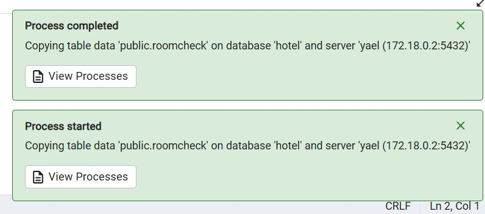
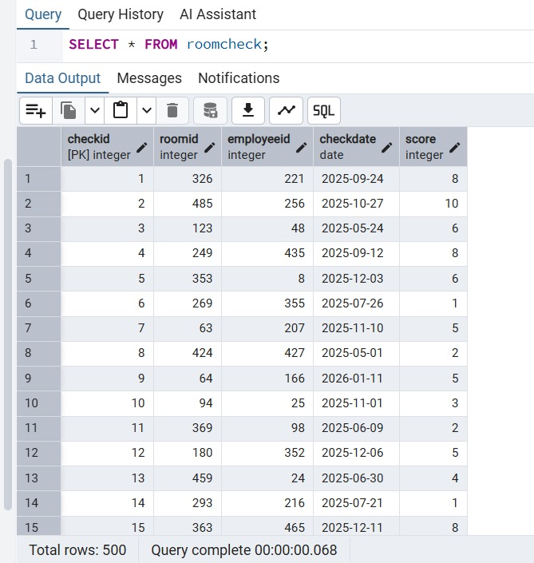

# 🏨 Hotel Management System - Housekeeping Unit

**Project Report**

**Authors:** Shani Levy and Yael Cohen

---

## 📑 Table of Contents
- [Introduction](#-introduction)
- [ERD & DSD](#-erd--dsd)
- [Workflow & Execution](#-workflow--execution)

---

איפיון המערכת - שנוצר על ידי Google AI Studio
https://aistudio.google.com/apps/45d4298d-a5b6-4634-97e4-b68336430388?showPreview=true&showAssistant=true

## 📋 Introduction
The system is a platform for managing the Housekeeping department in a hotel, designed to streamline cleaning, maintenance, and supervision processes in a smart and organized manner.
The system allows tracking and management of the following entities:

  **Rooms (`ROOM`)**:
    Managing the list of physical rooms in the hotel and ongoing monitoring.

  **Tasks and Cleaning Types (`TASKTYPE`, `HOUSEKEPINGTASK`)**:
    Defining task types (such as deep cleaning, evening turndown) and scheduling specific tasks for rooms, including priority and deadlines.

  **Statuses (`HOUSEKEEPINGSTATUS`)**:
    Real-time tracking of room/task status (e.g., dirty, in progress, clean, inspected).

  **Employees (`HOUSEKEEPINGEMPLOYEE`)**:
    Managing housekeeping employee details and shift schedules.

  **Execution Log (`CLEANNINGLOG`)**:
    Real-time digital documentation of task execution, including start/end times and employee notes.

  **Quality Control (`ROOMCHECK`)**:
    Inspections performed by supervisors, assigning quality scores for cleaning, and maintaining inspection history for continuous improvement.

  **Inventory and Supplies (`CLEANNINGSUPPLIES`, `USES`)**:
    Managing inventory of cleaning supplies and tools, and precise tracking of quantities consumed per task.

  **Employee-Task Relations (`BELONGSTO`)**:
    Smart assignment of employees to specific tasks for efficient execution.

---

## 📊 ERD & DSD

### 🔗 Entity Relationship Diagram (ERD)

### 📉 Data Structure Diagram (DSD)

## 🔄 Workflow & Execution

### 1. Data Generation
We utilized **Mockaroo** to generate realistic and structured dummy data for our database tables. This tool allowed us to define specific data types (e.g., names, dates, custom lists) and ensure referential integrity between tables (Foreign Keys). The configuration involved setting up fields exactly matching our ERD, generating thousands of records to simulate a busy hotel environment.

### 2. Data Processing Flow
The data pipeline follows a structured process:
- **Schema Design**: Creating the ERD and DSD diagrams.
- **Data Generation**: Using Mockaroo to produce raw data in CSV/SQL formats.
- **Script Execution**: Running our custom Python script to parse and insert data.
- **Database Population**: Storing the structured data into the RDBMS.

### 3. Data Insertion Script
A dedicated Python script (`insert_data.py`) was developed to automate the data insertion process. The script handles:
- Establishing a connection to the database.
- Reading and parsing the generated data files.
- Executing `INSERT` statements in batches for efficiency.
- Handling data type conversions (e.g., date formats) and error checking during insertion.

### 4. Database Verification
After the data insertion process, we verified the integrity and accuracy of the data using a database management tool (e.g., DBeaver). The screenshot below demonstrates a successful `SELECT` query execution, confirming that:
- Tables are populated correctly.
- Data types match the schema definitions.
- Relationships between entities are preserved.

