# 🏨 Hotel Management System - Housekeeping Unit

## 📘 Project Report

This database system was designed to manage the Housekeeping department of a hotel, tracking room statuses, cleaning tasks, employees, and cleaning supplies usage.

### 👩‍💻 Authors

* Yael Cohen
* Shani Gronberger

### 🏢 Project Scope

* **System:** Hotel Management System
* **Unit:** Housekeeping
---

## 📑 Table of Contents
- [System Link](#-system-link)
- [Introduction](#-introduction)
- [ERD & DSD](#-erd--dsd)
- [SQL Scripts](#sql-scripts)
- [Insertion Methods](#-insertion-methods)
- [Backup & Restore Strategy](#backup--restore-strategy)
- [SQL Query Analysis](#sql-query-analysis)

- [Delete Queries](#delete-queries)
  - [Delete 1: Specific Log Entry](#query-1-delete-specific-cleaning-log-entry)
  - [Delete 2: Archive Old Floor 1 Logs](#query-2-archive---delete-old-cleaning-logs-for-floor-1)
  - [Delete 3: Supply Usage History](#query-3-delete-usage-history-for-a-specific-supply-item)

- [Update Queries](#update-queries)
  - [Update 1: Escalate Overdue Tasks](#update-1-escalate-overdue-in-progress-tasks)
  - [Update 2: Restock Low Inventory](#update-2-restock-low-inventory-cleaning-supplies)
  - [Update 3: Synchronize Task Status](#update-3-synchronize-task-status-with-cleaning-logs)
  
- [Database Indexing Performance](#database-indexing-performance)
  - [Index 1: Date Range Optimization](#index-1-optimizing-date-range-searches-in-the-cleaning-log)
  - [Index 2: Foreign Key Optimization](#index-2-optimizing-foreign-key-lookups-employee-performance-tracking)
  - [Index 3: Junction Table Optimization](#index-3-optimizing-inventory-queries-in-the-junction-table-uses)  
---

## 🔗 System Link
[View the System in Google AI Studio](https://aistudio.google.com/apps/45d4298d-a5b6-4634-97e4-b68336430388?showPreview=true&showAssistant=true)


---
## 📋 Introduction
The system is a platform for managing the Housekeeping department in a hotel, designed to streamline cleaning, maintenance, and supervision processes in a smart and organized manner.
The system allows tracking and management of the following entities:

  **Rooms (`ROOM`)**:
    Managing the list of physical rooms in the hotel and ongoing monitoring.

  **Tasks and Cleaning Types (`TASKTYPE`, `HOUSEKEPINGTASK`)**:
    Defining task types (such as deep cleaning, evening turndown) and scheduling specific tasks for rooms, including priority and deadlines.

  **Statuses (`HOUSEKEEPINGSTATUS`)**:
    Real-time tracking of room/task status (e.g., dirty, in progress, clean, inspected).

  **Employees (`HOUSEKEEPINGEMPLOYEE`)**:
    Managing housekeeping employee details and shift schedules.

  **Execution Log (`CLEANNINGLOG`)**:
    Real-time digital documentation of task execution, including start/end times and employee notes.

  **Quality Control (`ROOMCHECK`)**:
    Inspections performed by supervisors, assigning quality scores for cleaning, and maintaining inspection history for continuous improvement.

  **Inventory and Supplies (`CLEANNINGSUPPLIES`, `USES`)**:
    Managing inventory of cleaning supplies and tools, and precise tracking of quantities consumed per task.

  **Employee-Task Relations (`BELONGSTO`)**:
    Smart assignment of employees to specific tasks for efficient execution.

---


## 📊 ERD & DSD

### 🔗 Entity Relationship Diagram (ERD)


### 📉 Data Structure Diagram (DSD)


### SQL Scripts

Provide the following SQL scripts:

* **Create Tables Script** - The SQL script for creating the database tables is available in the repository:
  
  📜 [View create_tables](./init-db/01-createTable.sql)

* **Insert Data Script** - The SQL script for insert data to the database tables is available in the repository:
  
  📜 [View insert_tables](./init-db/02-insertTables.sql)

* **Drop Tables Script** - The SQL script for droping all tables is available in the repository:
  
  📜 [View drop_tables](./init-db/03-dropTables.sql)

* **Select All Data Script** - The SQL script for selectAll tables is available in the repository:
  
  📜 [View selectAll_tables](./init-db/04-selectAll.sql)

## 🔄 Insertion Methods

### Method 1: Data Generation
* 📜 [View Mockaroo](./stage1/mockarooFiles/ROOMCHECK.sql)

We utilized **Mockaroo** to generate realistic and structured dummy data for our database tables. This tool allowed us to define specific data types (e.g., names, dates, custom lists) and ensure referential integrity between tables (Foreign Keys). The configuration involved setting up fields exactly matching our ERD, generating thousands of records to simulate a busy hotel environment.
Entering a data to ROOM table


### Method 2: Data Import from Files
* 📜 [View from Files](./stage1/DataImportFiles/ROOMCHECK.csv)

This method simulates a **Data Migration** process, where existing hotel records are imported into our new system. Instead of writing manual SQL commands, we use structured files to populate the database efficiently.
- **Bulk Loading**: We use the PostgreSQL `COPY` command or the pgAdmin Import tool to ingest thousands of rows from CSV (Comma-Separated Values) files directly into our tables.
- **Real-world Application**: This is the primary method used in the industry to move data between different systems or to upload large datasets provided by clients.
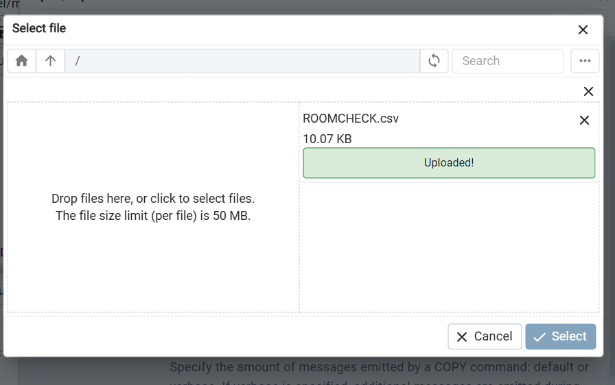


### Method 3: Scripted Insertion
* 📜 [View Python script](./stage1/Programming/insert_data.py)

A dedicated Python script (`insert_data.py`) was developed to automate the data insertion process. The script handles:
- Establishing a connection to the database.
- Reading and parsing the generated data files.
- Executing `INSERT` statements in batches for efficiency.
- Handling data type conversions (e.g., date formats) and error checking during insertion.


### Backup & Restore Strategy
* 📜 [View Backup File](./stage1/backup/backup_12_04_2026.sql)

To ensure data safety and continuity, we implemented a robust backup and restore strategy. Regular SQL dumps of the entire database schema and data are generated.
- **Backup**: Creating `.sql` snapshot files (e.g., `backup_12_04_2026.sql`) containing all logical data.
- **Restore**: The ability to reconstruct the database state from these files in case of failure or data corruption.
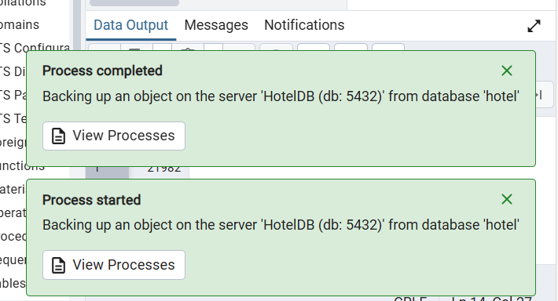


# SQL Query Analysis

## Standard Queries

Here are four main queries that demonstrate data retrieval and aggregation across the system's tables.

### Query 1: Employee Average Score
This query gets the average room check score for each employee, along with the total number of checks performed. It uses JOIN, GROUP BY, and HAVING clauses to filter and aggregate data.
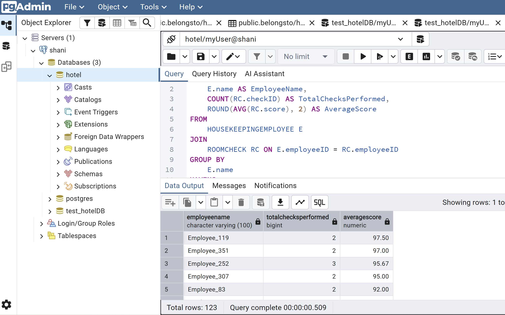

### Query 2: Urgent Tasks Supply Usage
This query finds the total quantity used for each cleaning supply for urgent tasks (priority = 5). It joins three tables and filters by a specific priority level.
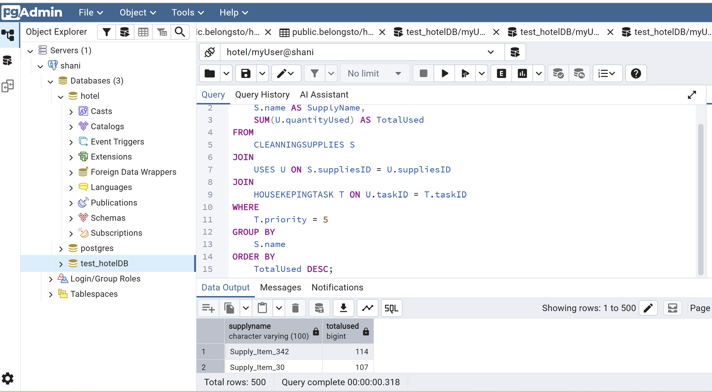

### Query 3: 'In Progress' Tasks Per Room
For each room, this query finds the total number of tasks that are currently 'In Progress'. It tracks ongoing work by joining room, task, and status tables.
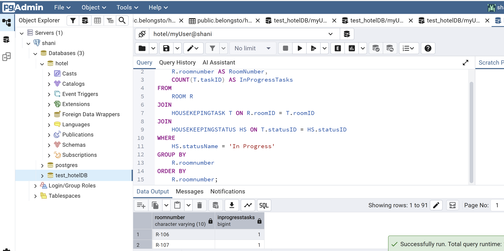

### Query 4: Average Task Duration
This query calculates the average duration in minutes for each task type based on completed cleaning logs. It joins multiple tables, extracts the time duration, and groups by task type.
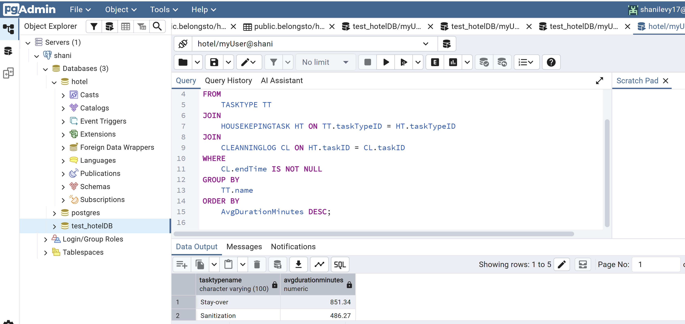

---

## Double Queries Analysis

### Introduction
This report presents a series of "Double Queries" (two different SQL versions yielding the same result) for the Hotel Housekeeping Management System. The objective is to demonstrate proficiency in complex table joins, subqueries, and database performance optimization.

---

## Query 1: Task Execution Distribution by Type (April 2026)

### Description
This query calculates the total number of times each type of task (e.g., 'Stay-over', 'Deep Clean') was performed during April 2026. This helps management understand which tasks are most common and how to allocate resources efficiently.

### SQL Implementation

**Version A: Standard 3-Table Join**  
Joins three tables (TASKTYPE, HOUSEKEEPINGTASK, CLEANINGLOG).  
Suitable for smaller datasets.
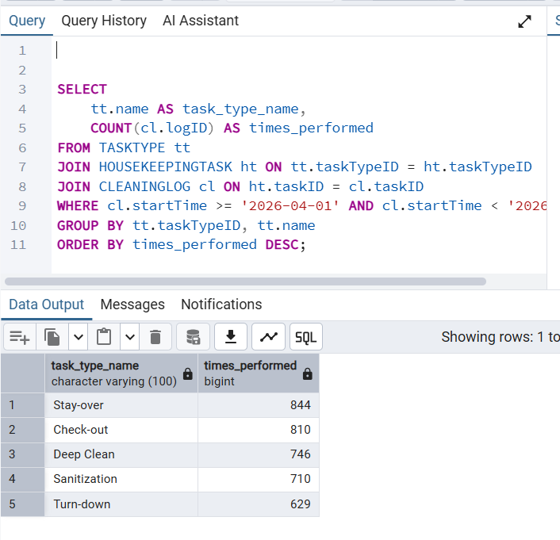


**Version B: Aggregated Subquery (Derived Table)**  
Performs aggregation inside a subquery before joining.  
More efficient because it works mainly with numeric IDs.
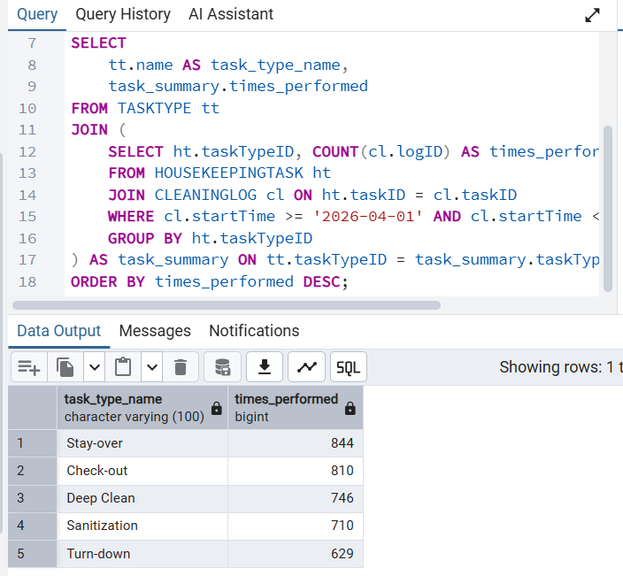


---

### Technical Analysis
Version A joins all tables before counting, including string data.  
Version B performs aggregation earlier using numeric IDs, which reduces memory usage and improves performance for large datasets.

---

## Query 2: Identifying Rooms Without Quality Inspections

### Description
This query finds rooms that do not appear in the ROOMCHECK table.  
It helps identify rooms that were not inspected and ensures quality standards.

### SQL Implementation

**Version A: NOT IN**  
Filters rooms based on a list of inspected room IDs.
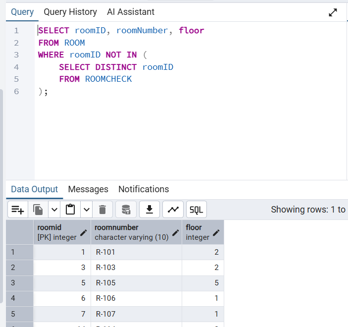


**Version B: NOT EXISTS**  
Checks for each room if no matching inspection exists.
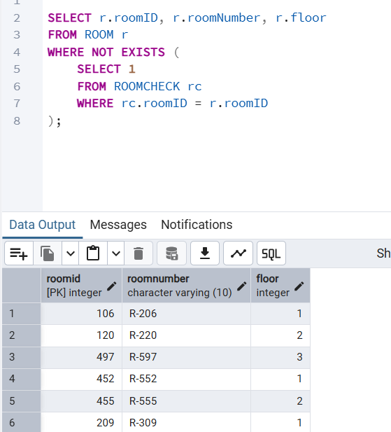


---

### Technical Analysis
NOT EXISTS is more efficient because it stops searching as soon as it finds a match.  
NOT IN usually scans the entire result set, which is slower for large datasets.
------------------

### Query 1: Delete Specific Cleaning Log Entry

**Description:**  
Deleting a specific cleaning log entry from the `CLEANINGLOG` table using a unique identifier (`logID`).  
This query demonstrates a simple deletion operation based on a primary key condition.

**SQL Code:**
```sql
DELETE FROM CLEANINGLOG
WHERE logID = 105;
```

Before Update: 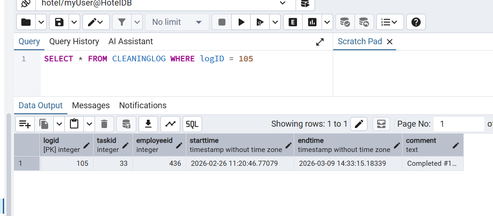

Execution Run : 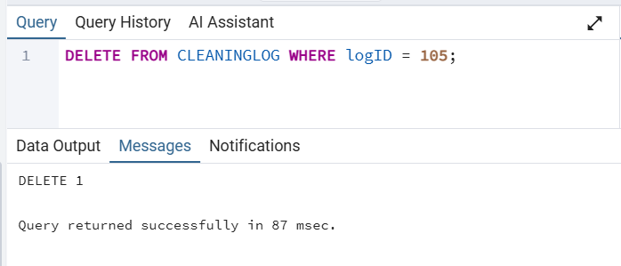

After Update: 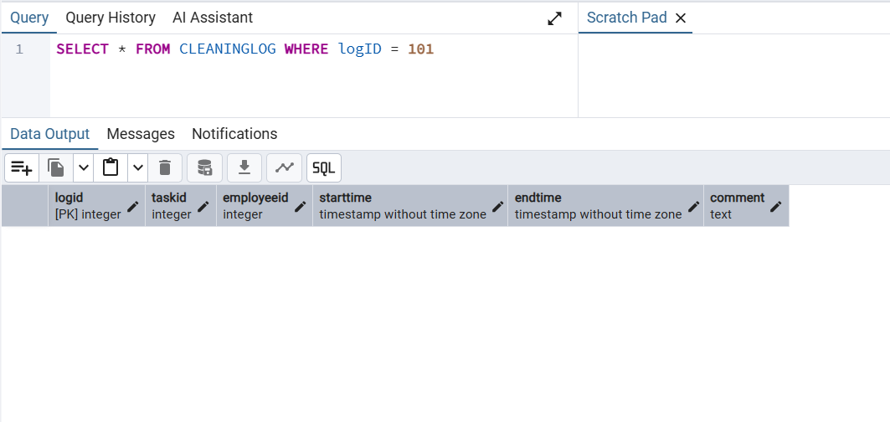


### Query 2: Archive - Delete Old Cleaning Logs for Floor 1

**Description:**  
Deleting cleaning log records created before April 10, 2026, specifically for rooms located on the first floor (rooms starting with 'R-1').  
This query uses nested subqueries and the `LIKE` operator to filter relevant rooms and their associated tasks.
**SQL Code:**
```sql
DELETE FROM CLEANINGLOG
WHERE startTime < '2026-04-10'
AND taskID IN (
    SELECT taskID 
    FROM HOUSEKEEPINGTASK 
    WHERE roomID IN (
        SELECT roomID 
        FROM ROOM 
        WHERE roomnumber LIKE 'R-1%'
    )
);
```
Before Update: 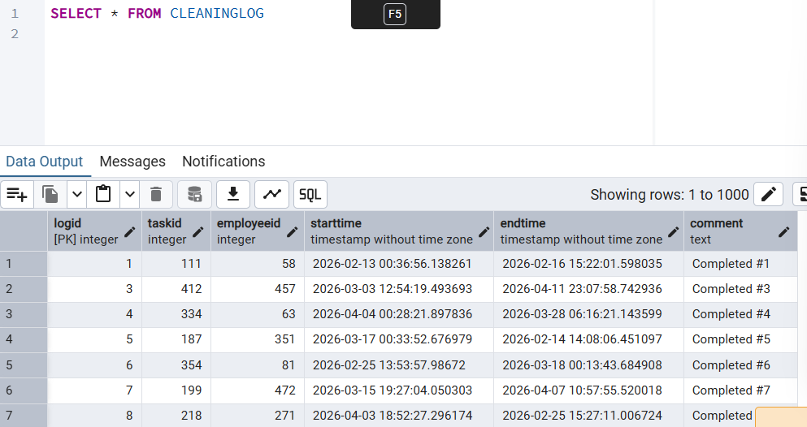

Execution Run : 

After Update: 


---

### Query 3: Delete Usage History for a Specific Supply Item
**Description:**  
Deleting the usage history of 'Supply_Item_26' from the `USES` table.  
The query uses a subquery to dynamically find the item's ID based on its name in the table.

**SQL Code:**
```sql
DELETE FROM USES
WHERE suppliesID = (
    SELECT suppliesID 
    FROM CLEANINGSUPPLIES 
    WHERE name = 'Supply_Item_27'
);
```
Before Update: 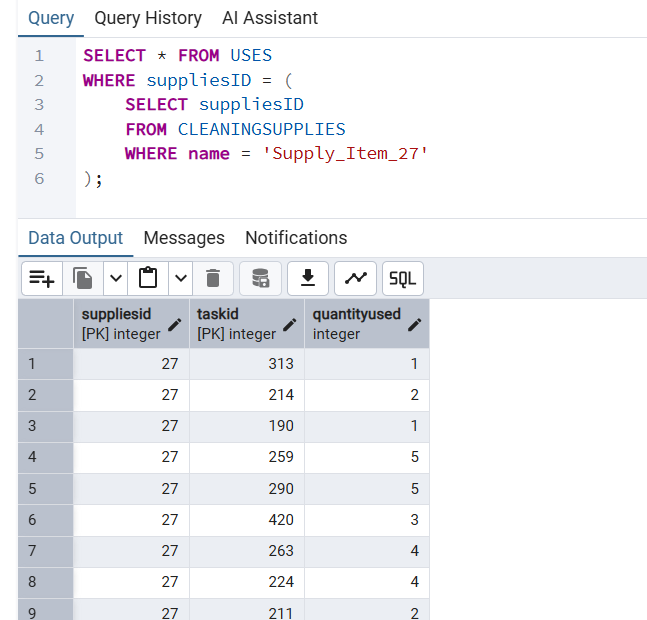

Execution Run : 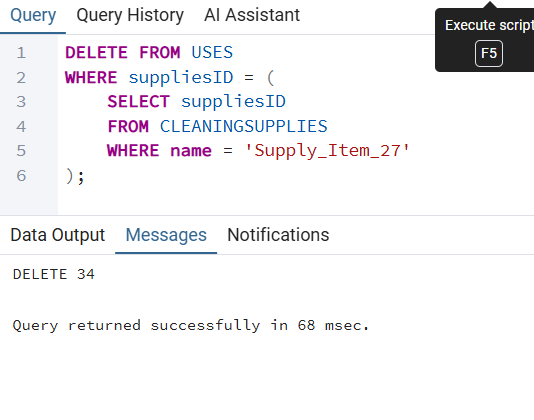

After Update: 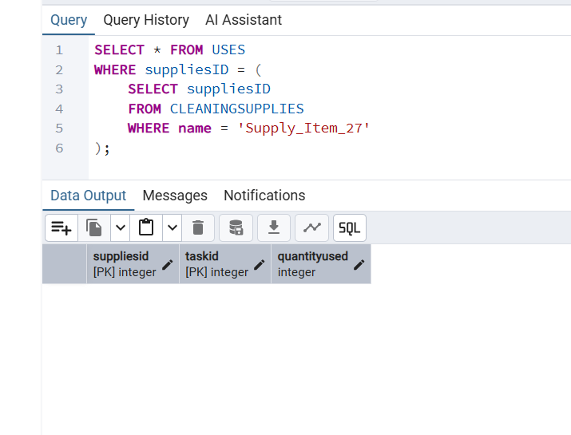


---
## Update Queries

The following update queries demonstrate data modification operations across the system's tables. Each query includes a **Before**, **Execution**, and **After** screenshot to show the effect of the update.

---

### Update 1: Escalate Overdue In-Progress Tasks

**Description:**  
This query escalates the priority to **urgent (5)** for all tasks that have an `'In Progress'` status and are past their due date.  
It ensures that overdue tasks are immediately flagged for attention, preventing further delays in housekeeping operations.

**SQL Code:**
```sql
UPDATE HOUSEKEPINGTASK
SET priority = 5
WHERE statusID = (
    SELECT statusID 
    FROM HOUSEKEEPINGSTATUS 
    WHERE statusName = 'In Progress'
)
AND dueDate < CURRENT_DATE;
```

Before Update: 

Execution Run: 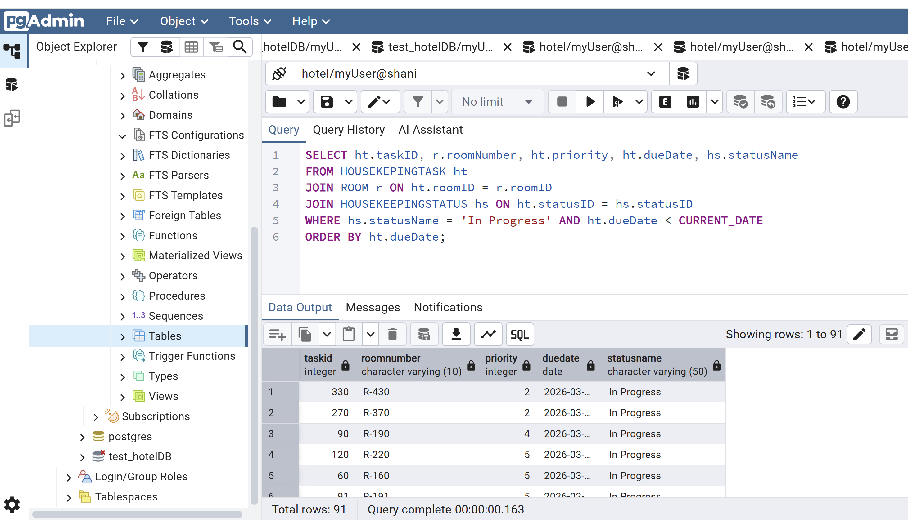

After Update: 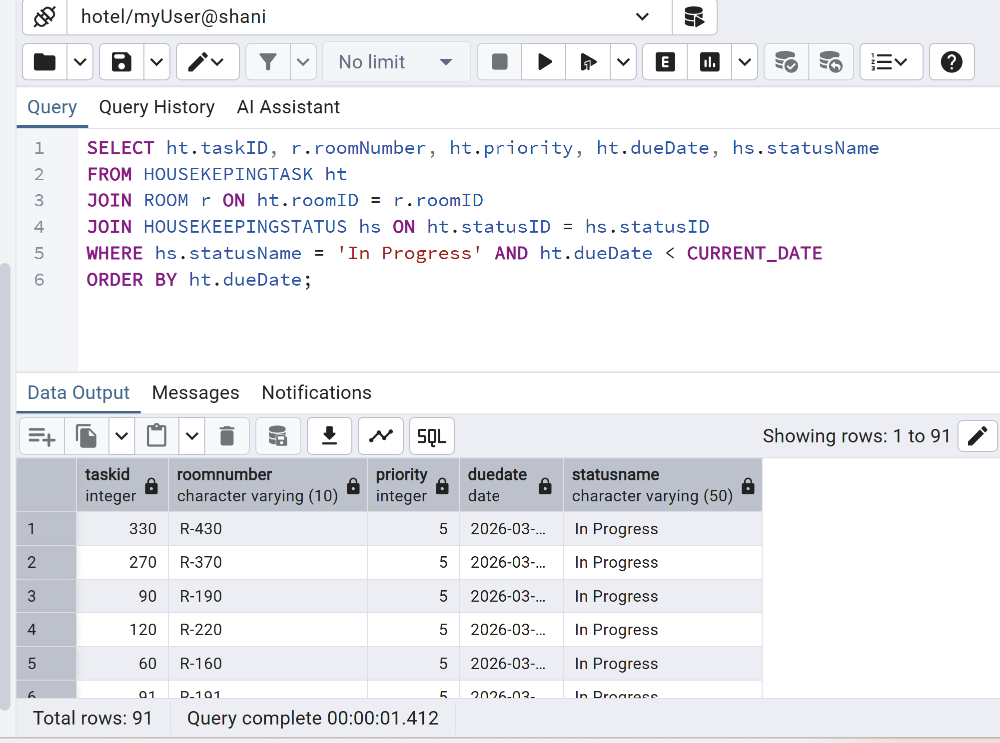

---

### Update 2: Restock Low-Inventory Cleaning Supplies

**Description:**  
This query adds **50 units** to any cleaning supply item that has fallen below a stock level of 10.  
It simulates an automated restocking mechanism to ensure essential supplies are always available for housekeeping staff.

**SQL Code:**
```sql
UPDATE CLEANNINGSUPPLIES
SET quantity = quantity + 50
WHERE quantity < 10;
```

Before Update: 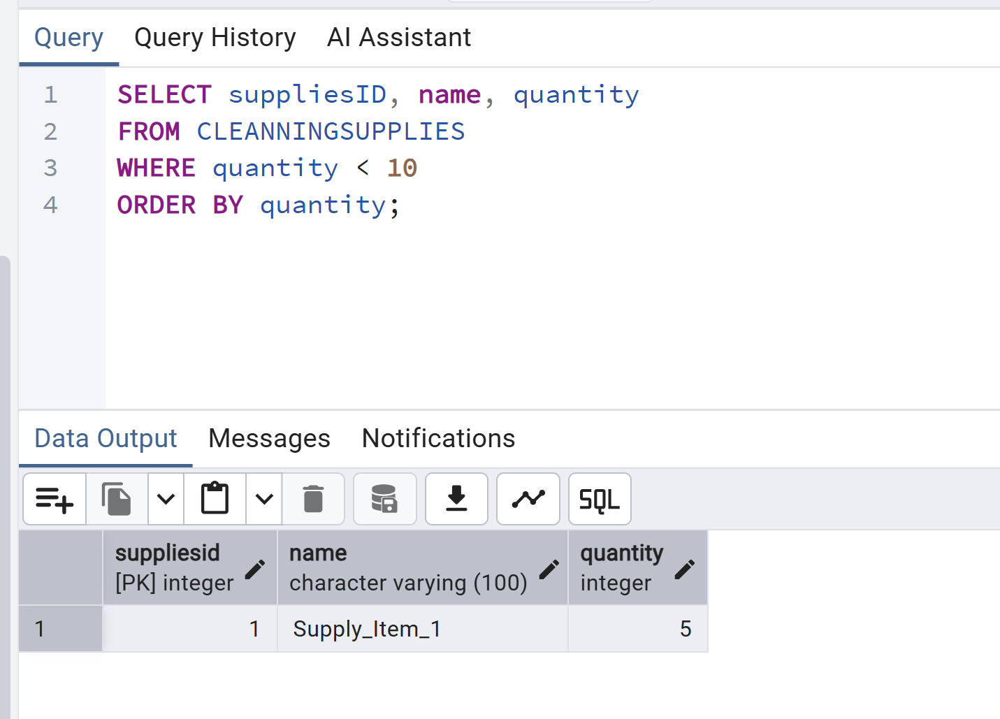

Execution Run: 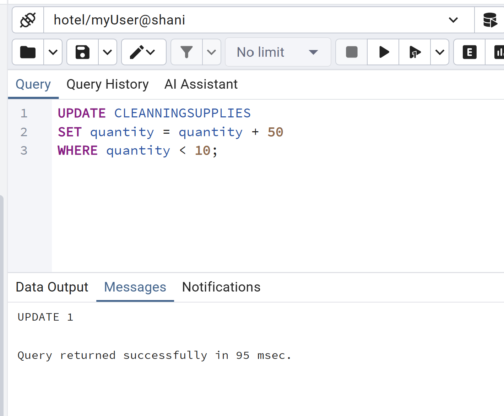

After Update: 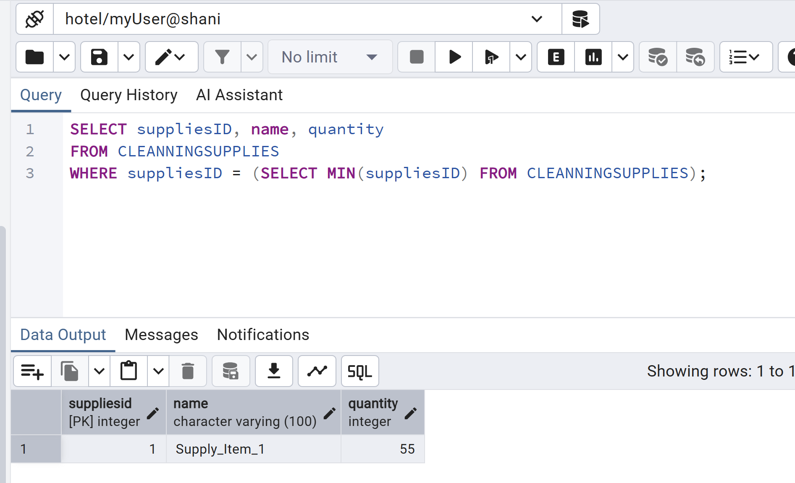

---

### Update 3: Synchronize Task Status with Cleaning Logs

**Description:**  
This query marks tasks as `'Clean'` when their corresponding cleaning log entry has a recorded `endTime` (meaning the cleaning was completed), but only if the task is not already in `'Clean'` status.  
It synchronizes the task statuses with actual cleaning activity, ensuring the system reflects real-world completion of work.

**SQL Code:**
```sql
UPDATE HOUSEKEPINGTASK
SET statusID = (
    SELECT statusID 
    FROM HOUSEKEEPINGSTATUS 
    WHERE statusName = 'Clean'
)
WHERE taskID IN (
    SELECT taskID 
    FROM CLEANNINGLOG 
    WHERE endTime IS NOT NULL
)
AND statusID != (
    SELECT statusID 
    FROM HOUSEKEEPINGSTATUS 
    WHERE statusName = 'Clean'
);
```

Before Update: 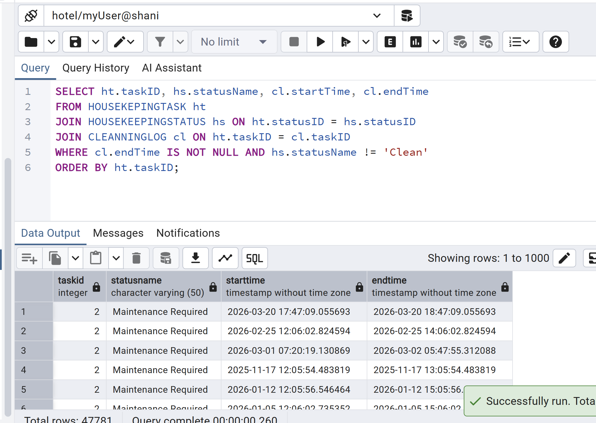

Execution Run: 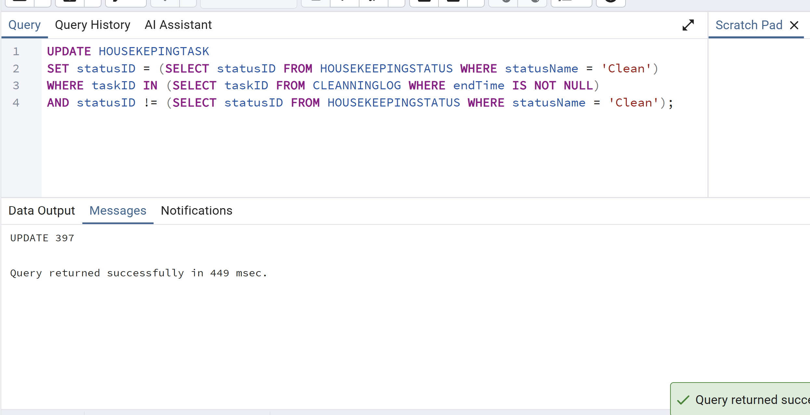

After Update: 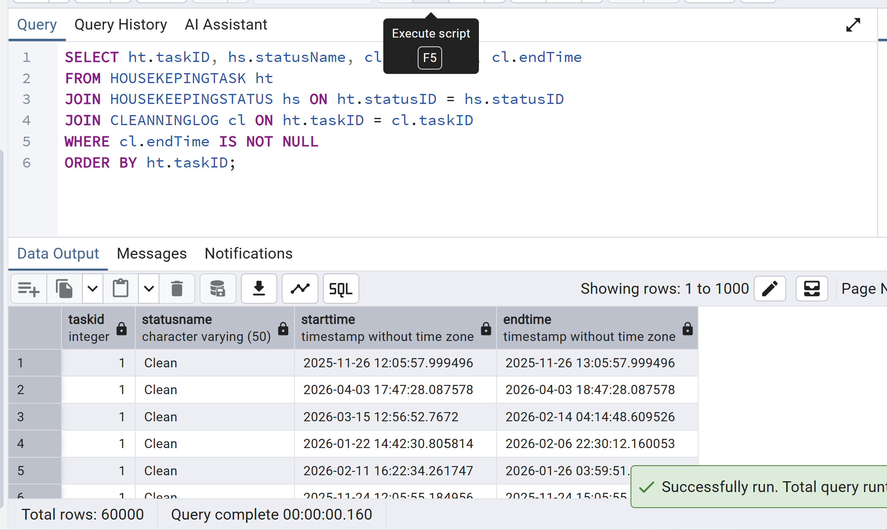


## Index 1: Optimizing Date Range Searches in the Cleaning Log

**Motivation and Benefit:**
In a hotel management system, generating periodic reports (e.g., "which rooms were cleaned during a specific month") is a highly frequent operation. Without an index, the database engine is forced to perform a Sequential Scan (`Seq Scan`) across all 20,000 records in the `cleaninglog` table. Creating a B-Tree index on the `starttime` column allows the system to jump directly to the requested time range, significantly improving response times.

**Test Query:**
```sql
EXPLAIN ANALYZE 
SELECT * FROM cleaninglog 
WHERE starttime BETWEEN '2025-06-01' AND '2025-12-31';
```
Results and Explanation:

Execution Time BEFORE (Seq Scan): ~15.702 milliseconds (ms). The system scanned all rows in the table.

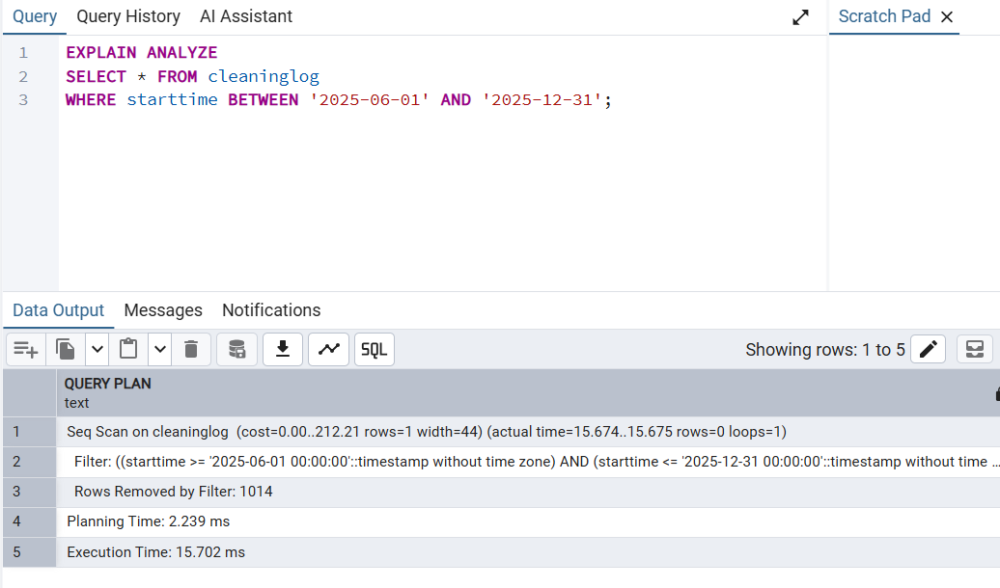

Index Creation Command:

```
CREATE INDEX idx_cleaninglog_starttime ON cleaninglog(starttime);
```
Execution Time AFTER (Index Scan): ~0.012 milliseconds (ms).

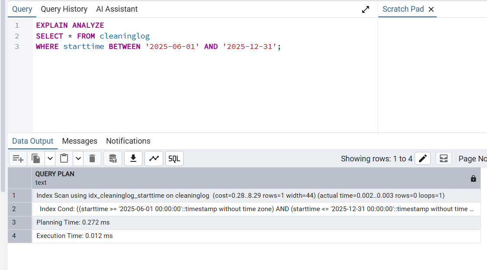

Analysis: The retrieval time improved by a factor of over 1,000. The system bypassed the sequential scan and accessed the relevant data directly.

## Index 2: Optimizing Foreign Key Lookups (Employee Performance Tracking)

**Motivation and Benefit:**
The `employeeid` column in the `cleaninglog` table acts as a Foreign Key referencing the `employee` table. Relational database management systems (like PostgreSQL) do not automatically create indexes on foreign keys. In a hotel system, managers frequently query this table to review a specific employee's task history. Adding an index to this Foreign Key prevents full table scans when filtering by specific employees, greatly enhancing the performance of these routine administrative queries.

**Test Query:**
```sql
EXPLAIN ANALYZE 
SELECT * FROM cleaninglog 
WHERE employeeid = 5;
```
Results and Explanation:

Execution Time BEFORE Index Creation: ~3.051 milliseconds (ms).

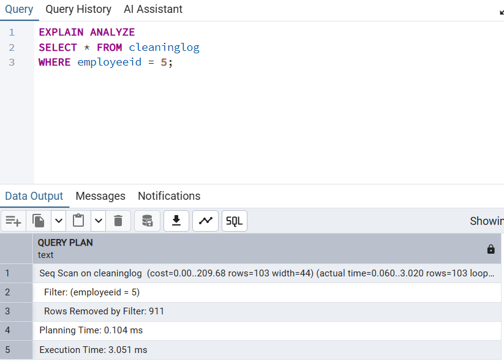

Index Creation Command:

```sql
CREATE INDEX idx_cleaninglog_employeeid ON cleaninglog(employeeid);
```
Execution Time AFTER Index Creation: ~1.512 milliseconds (ms).

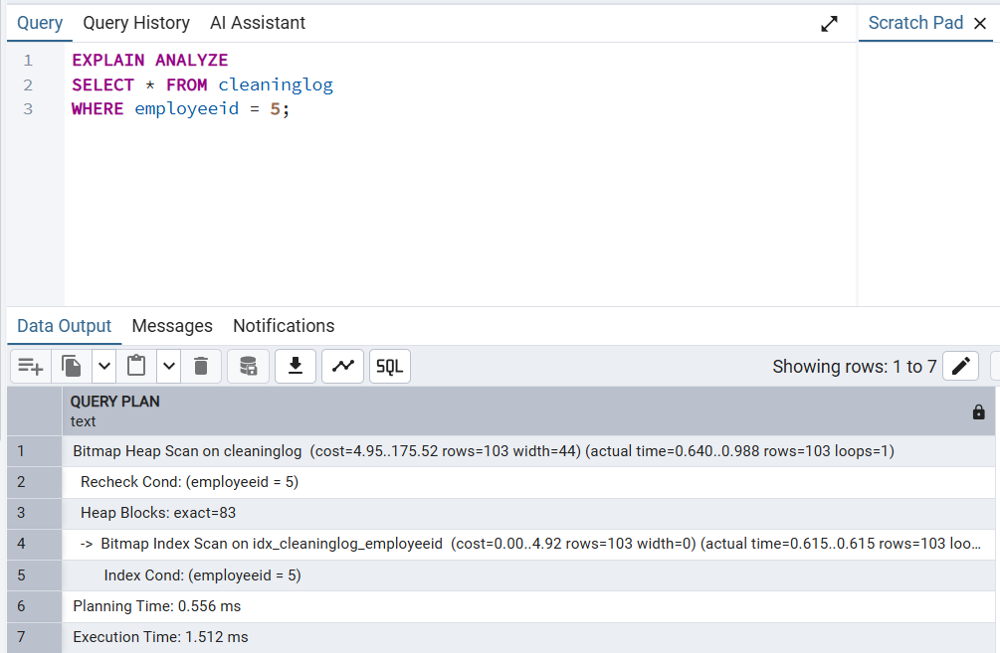

Analysis: After applying the index, the execution time was cut in half. The database engine opted for a Bitmap Index Scan, which is a highly efficient way for PostgreSQL to fetch multiple rows associated with a single ID from a large dataset.

## Index 3: Optimizing Inventory Queries in the Junction Table (USES)

**Motivation and Benefit:**
The `uses` table is a junction table that tracks the equipment utilized in each task. Queries checking "which tasks used a specific inventory item" are critical for inventory management. Adding an index on `suppliesid` optimizes data retrieval from this heavy table (20,000 records), even though the column is part of a composite primary key. It allows for direct filtering without relying on the slower primary key scan.

**Test Query:**
```sql
EXPLAIN ANALYZE 
SELECT * FROM uses 
WHERE suppliesid = 3;
```

Results and Explanation:

Execution Time BEFORE Index Creation: ~27.833 milliseconds (ms).

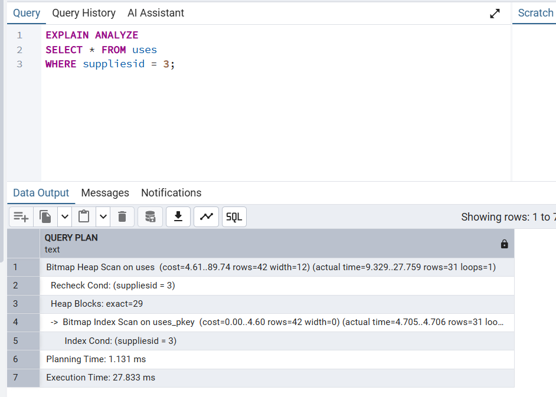

Index Creation Command:

```sql
CREATE INDEX idx_uses_supplies ON uses(suppliesid);
```

Execution Time AFTER Index Creation: ~0.179 milliseconds (ms).

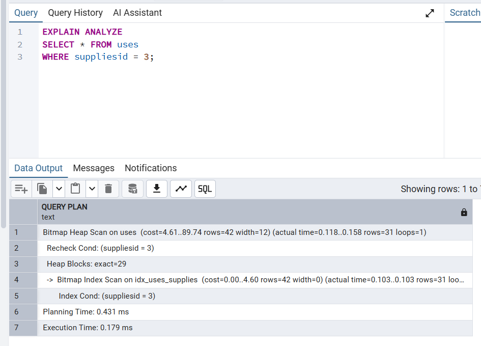

Analysis: This represents a massive performance jump (around 150x faster). The dedicated index allowed the database to bypass the complex primary key scan and retrieve the inventory usage data almost instantaneously