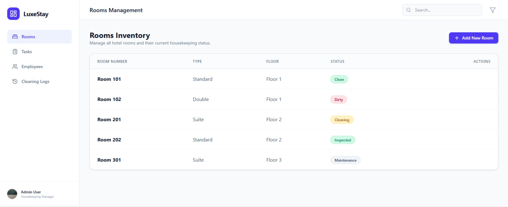
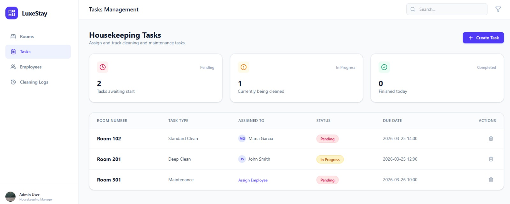
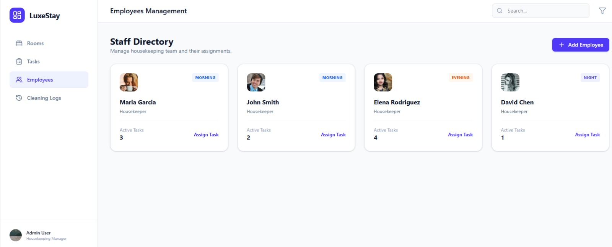
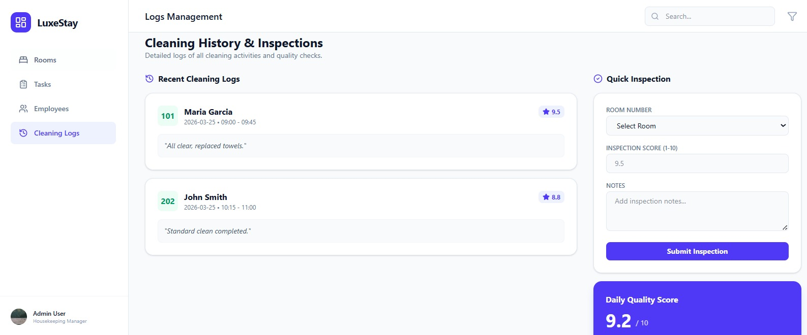
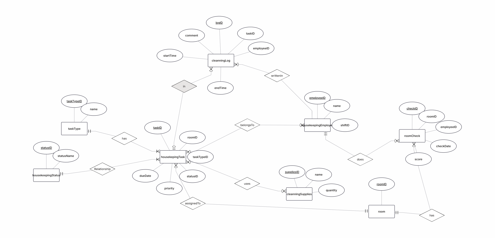
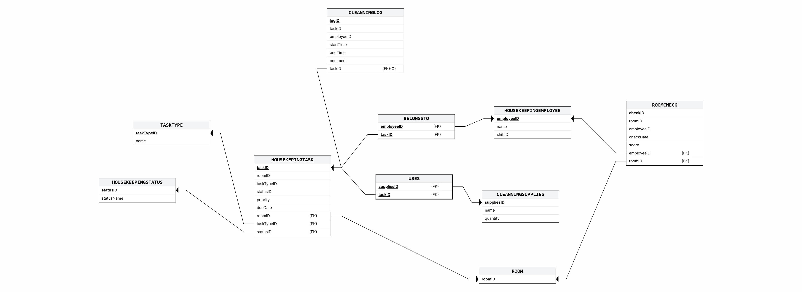
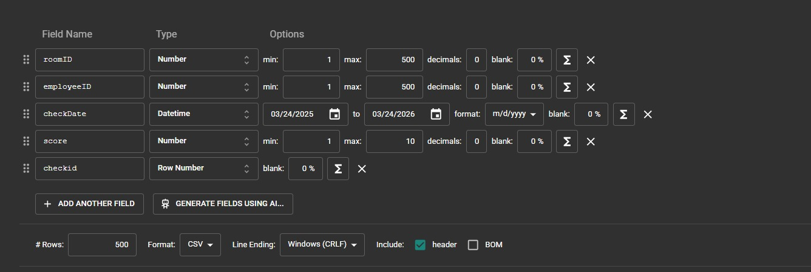
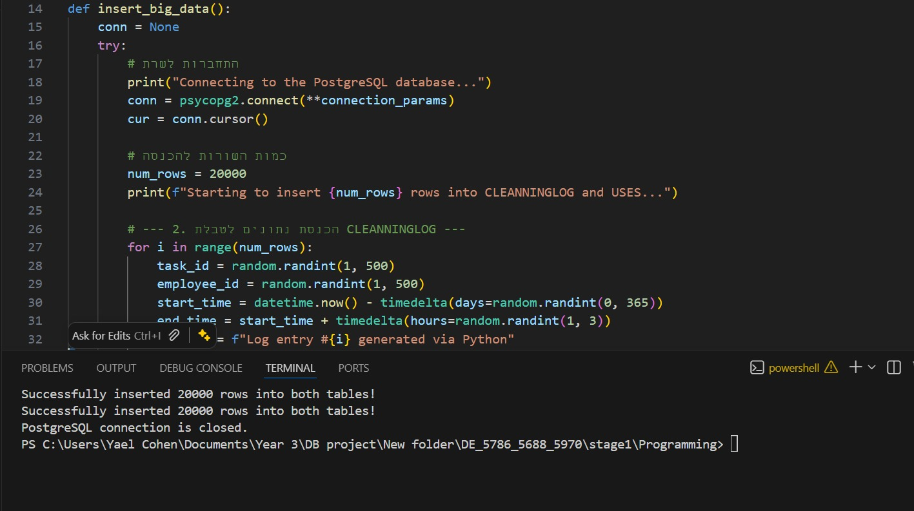
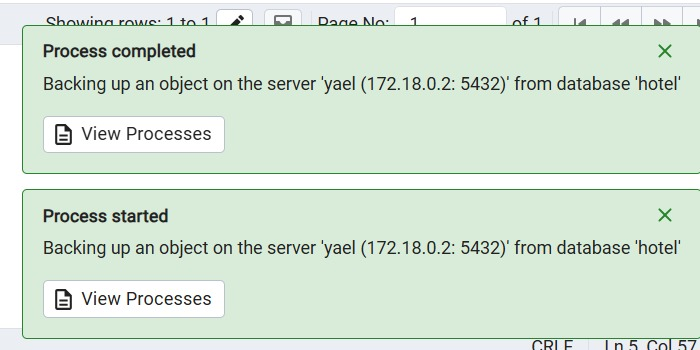

# 🏨 Hotel Management System - Housekeeping Unit

## 📘 Project Report

This database system was designed to manage the Housekeeping department of a hotel, tracking room statuses, cleaning tasks, employees, and cleaning supplies usage.

### 👩‍💻 Authors

* Yael Cohen
* Shani Gronberger

### 🏢 Project Scope

* **System:** Hotel Management System
* **Unit:** Housekeeping
---

## 📑 Table of Contents
## 📑 Table of Contents
- [Introduction](#-introduction)
- [ERD & DSD](#-erd--dsd)
- [SQL Scripts](#sql-scripts)
- [Insertion Methods](#-insertion-methods)
- [Backup & Restore Strategy](#-backup--restore-strategy)
---

## 🔗 System Link
[View the System in Google AI Studio](https://aistudio.google.com/apps/45d4298d-a5b6-4634-97e4-b68336430388?showPreview=true&showAssistant=true)

---
## 📋 Introduction
The system is a platform for managing the Housekeeping department in a hotel, designed to streamline cleaning, maintenance, and supervision processes in a smart and organized manner.
The system allows tracking and management of the following entities:

  **Rooms (`ROOM`)**:
    Managing the list of physical rooms in the hotel and ongoing monitoring.

  **Tasks and Cleaning Types (`TASKTYPE`, `HOUSEKEPINGTASK`)**:
    Defining task types (such as deep cleaning, evening turndown) and scheduling specific tasks for rooms, including priority and deadlines.

  **Statuses (`HOUSEKEEPINGSTATUS`)**:
    Real-time tracking of room/task status (e.g., dirty, in progress, clean, inspected).

  **Employees (`HOUSEKEEPINGEMPLOYEE`)**:
    Managing housekeeping employee details and shift schedules.

  **Execution Log (`CLEANNINGLOG`)**:
    Real-time digital documentation of task execution, including start/end times and employee notes.

  **Quality Control (`ROOMCHECK`)**:
    Inspections performed by supervisors, assigning quality scores for cleaning, and maintaining inspection history for continuous improvement.

  **Inventory and Supplies (`CLEANNINGSUPPLIES`, `USES`)**:
    Managing inventory of cleaning supplies and tools, and precise tracking of quantities consumed per task.

  **Employee-Task Relations (`BELONGSTO`)**:
    Smart assignment of employees to specific tasks for efficient execution.

---

## 📊 ERD & DSD

### 🔗 Entity Relationship Diagram (ERD)

### 📉 Data Structure Diagram (DSD)

### SQL Scripts

Provide the following SQL scripts:

* **Create Tables Script** - The SQL script for creating the database tables is available in the repository:
  
  📜 [View create_tables](./init-db/01-createTable.sql)

* **Insert Data Script** - The SQL script for insert data to the database tables is available in the repository:
  
  📜 [View insert_tables](./init-db/02-insertTables.sql)

* **Drop Tables Script** - The SQL script for droping all tables is available in the repository:
  
  📜 [View drop_tables](./init-db/03-dropTables.sql)

* **Select All Data Script** - The SQL script for selectAll tables is available in the repository:
  
  📜 [View selectAll_tables](./init-db/04-selectAll.sql)

## 🔄 Insertion Methods

### Method 1: Data Generation
* 📜 [View ROOMCHECK_data.sql](./stage1/mockarooFiles/ROOMCHECK_data.sql)

We utilized **Mockaroo** to generate realistic and structured dummy data for our database tables. This tool allowed us to define specific data types (e.g., names, dates, custom lists) and ensure referential integrity between tables (Foreign Keys). The configuration involved setting up fields exactly matching our ERD, generating thousands of records to simulate a busy hotel environment.
Entering a data to ROOM table

### Method 2: Data Import from Files
* 📜 [View ROOMCHECK.csv](./stage1/DataImportFiles/ROOMCHECK.csv)

This method simulates a **Data Migration** process, where existing hotel records are imported into our new system. Instead of writing manual SQL commands, we use structured files to populate the database efficiently.
- **Bulk Loading**: We use the PostgreSQL `COPY` command or the pgAdmin Import tool to ingest thousands of rows from CSV (Comma-Separated Values) files directly into our tables.
- **Real-world Application**: This is the primary method used in the industry to move data between different systems or to upload large datasets provided by clients.

### Method 3: Scripted Insertion
* 📜 [View insert_data.py](./stage1/Programming/insert_data.py)

A dedicated Python script (`insert_data.py`) was developed to automate the data insertion process. The script handles:
- Establishing a connection to the database.
- Reading and parsing the generated data files.
- Executing `INSERT` statements in batches for efficiency.
- Handling data type conversions (e.g., date formats) and error checking during insertion.

### Backup & Restore Strategy
* 📜 [View Backup File](./stage1/backup/backup_25_03_2026.sql)

To ensure data safety and continuity, we implemented a robust backup and restore strategy. Regular SQL dumps of the entire database schema and data are generated.
- **Backup**: Creating `.sql` snapshot files (e.g., `backup_19_03_2026.sql`) containing all logical data.
- **Restore**: The ability to reconstruct the database state from these files in case of failure or data corruption.
