# 🏨 Hotel Management System - Housekeeping Unit

## 📘 Project Report

This database system was designed to manage the Housekeeping department of a hotel, tracking room statuses, cleaning tasks, employees, and cleaning supplies usage.

### 👩‍💻 Authors

* Yael Cohen
* Shani Gronberger

### 🏢 Project Scope

* **System:** Hotel Management System
* **Unit:** Housekeeping
---

## 📑 Table of Contents
- [System Link](#-system-link)
- [Introduction](#-introduction)
- [ERD & DSD](#-erd--dsd)
- [SQL Scripts](#sql-scripts)
- [Insertion Methods](#-insertion-methods)
- [Backup & Restore Strategy](#backup--restore-strategy)
- [SQL Query Analysis](#sql-query-analysis)

- [Delete Queries](#delete-queries)
  - [Delete 1: Specific Log Entry](#query-1-delete-specific-cleaning-log-entry)
  - [Delete 2: Archive Old Floor 1 Logs](#query-2-archive---delete-old-cleaning-logs-for-floor-1)
  - [Delete 3: Supply Usage History](#query-3-delete-usage-history-for-a-specific-supply-item)

- [Update Queries](#update-queries)
  - [Update 1: Escalate Overdue Tasks](#update-1-escalate-overdue-in-progress-tasks)
  - [Update 2: Restock Low Inventory](#update-2-restock-low-inventory-cleaning-supplies)
  - [Update 3: Synchronize Task Status](#update-3-synchronize-task-status-with-cleaning-logs)
  
- [Database Indexing Performance](#database-indexing-performance)
  - [Index 1: Date Range Optimization](#index-1-optimizing-date-range-searches-in-the-cleaning-log)
  - [Index 2: Foreign Key Optimization](#index-2-optimizing-foreign-key-lookups-employee-performance-tracking)
  - [Index 3: Junction Table Optimization](#index-3-optimizing-inventory-queries-in-the-junction-table-uses)  

- [Database Constraints Analysis](#database-constraints-analysis)
  - [Constraint 1: Inventory Integrity](#1-inventory-integrity-cleaningsupplies-table)
  - [Constraint 2: Score Range Validation](#2-score-range-validation-roomcheck-table)
  - [Constraint 3: Task Uniqueness Prevention](#3-task-uniqueness-prevention-housekeepingtask-table)

- [Stage C: Integration and Views](#stage-c-integration-and-views)


    
---

## 🔗 System Link
[View the System in Google AI Studio](https://aistudio.google.com/apps/45d4298d-a5b6-4634-97e4-b68336430388?showPreview=true&showAssistant=true)


---
## 📋 Introduction
The system is a platform for managing the Housekeeping department in a hotel, designed to streamline cleaning, maintenance, and supervision processes in a smart and organized manner.
The system allows tracking and management of the following entities:

  **Rooms (`ROOM`)**:
    Managing the list of physical rooms in the hotel and ongoing monitoring.

  **Tasks and Cleaning Types (`TASKTYPE`, `HOUSEKEEPINGTASK`)**:
    Defining task types (such as deep cleaning, evening turndown) and scheduling specific tasks for rooms, including priority and deadlines.

  **Statuses (`HOUSEKEEPINGSTATUS`)**:
    Real-time tracking of room/task status (e.g., dirty, in progress, clean, inspected).

  **Employees (`HOUSEKEEPINGEMPLOYEE`)**:
    Managing housekeeping employee details and shift schedules.

  **Execution Log (`CLEANINGLOG`)**:
    Real-time digital documentation of task execution, including start/end times and employee notes.

  **Quality Control (`ROOMCHECK`)**:
    Inspections performed by supervisors, assigning quality scores for cleaning, and maintaining inspection history for continuous improvement.

  **Inventory and Supplies (`CLEANINGSUPPLIES`, `USES`)**:
    Managing inventory of cleaning supplies and tools, and precise tracking of quantities consumed per task.

  **Employee-Task Relations (`BELONGSTO`)**:
    Smart assignment of employees to specific tasks for efficient execution.

---


## 📊 ERD & DSD

### 🔗 Entity Relationship Diagram (ERD)


### 📉 Data Structure Diagram (DSD)


### SQL Scripts

Provide the following SQL scripts:

* **Create Tables Script** - The SQL script for creating the database tables is available in the repository:
  
  📜 [View create_tables](./init-db/01-createTable.sql)

* **Insert Data Script** - The SQL script for insert data to the database tables is available in the repository:
  
  📜 [View insert_tables](./init-db/02-insertTables.sql)

* **Drop Tables Script** - The SQL script for droping all tables is available in the repository:
  
  📜 [View drop_tables](./init-db/03-dropTables.sql)

* **Select All Data Script** - The SQL script for selectAll tables is available in the repository:
  
  📜 [View selectAll_tables](./init-db/04-selectAll.sql)

## 🔄 Insertion Methods

### Method 1: Data Generation
* 📜 [View Mockaroo](./stage1/mockarooFiles/ROOMCHECK.sql)

We utilized **Mockaroo** to generate realistic and structured dummy data for our database tables. This tool allowed us to define specific data types (e.g., names, dates, custom lists) and ensure referential integrity between tables (Foreign Keys). The configuration involved setting up fields exactly matching our ERD, generating thousands of records to simulate a busy hotel environment.
Entering a data to ROOM table


### Method 2: Data Import from Files
* 📜 [View from Files](./stage1/DataImportFiles/ROOMCHECK.csv)

This method simulates a **Data Migration** process, where existing hotel records are imported into our new system. Instead of writing manual SQL commands, we use structured files to populate the database efficiently.
- **Bulk Loading**: We use the PostgreSQL `COPY` command or the pgAdmin Import tool to ingest thousands of rows from CSV (Comma-Separated Values) files directly into our tables.
- **Real-world Application**: This is the primary method used in the industry to move data between different systems or to upload large datasets provided by clients.


### Method 3: Scripted Insertion
* 📜 [View Python script](./stage1/Programming/insert_data.py)

A dedicated Python script (`insert_data.py`) was developed to automate the data insertion process. The script handles:
- Establishing a connection to the database.
- Reading and parsing the generated data files.
- Executing `INSERT` statements in batches for efficiency.
- Handling data type conversions (e.g., date formats) and error checking during insertion.


### Backup & Restore Strategy
* 📜 [View Backup File](./stage1/backup/backup_12_04_2026.sql)

To ensure data safety and continuity, we implemented a robust backup and restore strategy. Regular SQL dumps of the entire database schema and data are generated.
- **Backup**: Creating `.sql` snapshot files (e.g., `backup_12_04_2026.sql`) containing all logical data.
- **Restore**: The ability to reconstruct the database state from these files in case of failure or data corruption.


# SQL Query Analysis

## Standard Queries

Here are four main queries that demonstrate data retrieval and aggregation across the system's tables.

### Query 1: Employee Average Score
This query gets the average room check score for each employee, along with the total number of checks performed. It uses JOIN, GROUP BY, and HAVING clauses to filter and aggregate data.


### Query 2: Urgent Tasks Supply Usage
This query finds the total quantity used for each cleaning supply for urgent tasks (priority = 5). It joins three tables and filters by a specific priority level.


### Query 3: 'In Progress' Tasks Per Room
For each room, this query finds the total number of tasks that are currently 'In Progress'. It tracks ongoing work by joining room, task, and status tables.


### Query 4: Average Task Duration
This query calculates the average duration in minutes for each task type based on completed cleaning logs. It joins multiple tables, extracts the time duration, and groups by task type.


---

## Double Queries Analysis

### Introduction
This report presents a series of "Double Queries" (two different SQL versions yielding the same result) for the Hotel Housekeeping Management System. The objective is to demonstrate proficiency in complex table joins, subqueries, and database performance optimization.

---

## Query 1: Task Execution Distribution by Type (April 2026)

### Description
This query calculates the total number of times each type of task (e.g., 'Stay-over', 'Deep Clean') was performed during April 2026. This helps management understand which tasks are most common and how to allocate resources efficiently.

### SQL Implementation

**Version A: Standard 3-Table Join**  
Joins three tables (TASKTYPE, HOUSEKEEPINGTASK, CLEANINGLOG).  
Suitable for smaller datasets.


**Version B: Aggregated Subquery (Derived Table)**  
Performs aggregation inside a subquery before joining.  
More efficient because it works mainly with numeric IDs.


---

### Technical Analysis
Version A joins all tables before counting, including string data.  
Version B performs aggregation earlier using numeric IDs, which reduces memory usage and improves performance for large datasets.

---

## Query 2: Identifying Rooms Without Quality Inspections

### Description
This query finds rooms that do not appear in the ROOMCHECK table.  
It helps identify rooms that were not inspected and ensures quality standards.

### SQL Implementation

**Version A: NOT IN**  
Filters rooms based on a list of inspected room IDs.


**Version B: NOT EXISTS**  
Checks for each room if no matching inspection exists.


---

### Technical Analysis
NOT EXISTS is more efficient because it stops searching as soon as it finds a match.  
NOT IN usually scans the entire result set, which is slower for large datasets.
------------------

### Query 1: Delete Specific Cleaning Log Entry

**Description:**  
Deleting a specific cleaning log entry from the `CLEANINGLOG` table using a unique identifier (`logID`).  
This query demonstrates a simple deletion operation based on a primary key condition.

**SQL Code:**
```sql
DELETE FROM CLEANINGLOG
WHERE logID = 105;
```

Before: 

Execution Run : 

After: 


### Query 2: Archive - Delete Old Cleaning Logs for Floor 1

**Description:**  
Deleting cleaning log records created before April 10, 2026, specifically for rooms located on the first floor (rooms starting with 'R-1').  
This query uses nested subqueries and the `LIKE` operator to filter relevant rooms and their associated tasks.
**SQL Code:**
```sql
DELETE FROM CLEANINGLOG
WHERE startTime < '2026-04-10'
AND taskID IN (
    SELECT taskID 
    FROM HOUSEKEEPINGTASK 
    WHERE roomID IN (
        SELECT roomID 
        FROM ROOM 
        WHERE roomnumber LIKE 'R-1%'
    )
);
```
Before: 

Execution Run : 

After: 


---

### Query 3: Delete Usage History for a Specific Supply Item
**Description:**  
Deleting the usage history of 'Supply_Item_26' from the `USES` table.  
The query uses a subquery to dynamically find the item's ID based on its name in the table.

**SQL Code:**
```sql
DELETE FROM USES
WHERE suppliesID = (
    SELECT suppliesID 
    FROM CLEANINGSUPPLIES 
    WHERE name = 'Supply_Item_27'
);
```
Before: 

Execution Run : 

After: 


---
## Update Queries

The following update queries demonstrate data modification operations across the system's tables. Each query includes a **Before**, **Execution**, and **After** screenshot to show the effect of the update.

---

### Update 1: Escalate Overdue In-Progress Tasks

**Description:**  
This query escalates the priority to **urgent (5)** for all tasks that have an `'In Progress'` status and are past their due date.  
It ensures that overdue tasks are immediately flagged for attention, preventing further delays in housekeeping operations.

**SQL Code:**
```sql
UPDATE HOUSEKEEPINGTASK
SET priority = 5
WHERE statusID = (
    SELECT statusID 
    FROM HOUSEKEEPINGSTATUS 
    WHERE statusName = 'In Progress'
)
AND dueDate < CURRENT_DATE;
```

Before Update: 

Execution Run: 

After Update: 

---

### Update 2: Restock Low-Inventory Cleaning Supplies

**Description:**  
This query adds **50 units** to any cleaning supply item that has fallen below a stock level of 10.  
It simulates an automated restocking mechanism to ensure essential supplies are always available for housekeeping staff.

**SQL Code:**
```sql
UPDATE CLEANINGSUPPLIES
SET quantity = quantity + 50
WHERE quantity < 10;
```

Before Update: 

Execution Run: 

After Update: 

---

### Update 3: Synchronize Task Status with Cleaning Logs

**Description:**  
This query marks tasks as `'Clean'` when their corresponding cleaning log entry has a recorded `endTime` (meaning the cleaning was completed), but only if the task is not already in `'Clean'` status.  
It synchronizes the task statuses with actual cleaning activity, ensuring the system reflects real-world completion of work.

**SQL Code:**
```sql
UPDATE HOUSEKEPINGTASK
SET statusID = (
    SELECT statusID 
    FROM HOUSEKEEPINGSTATUS 
    WHERE statusName = 'Clean'
)
WHERE taskID IN (
    SELECT taskID 
    FROM CLEANINGLOG 
    WHERE endTime IS NOT NULL
)
AND statusID != (
    SELECT statusID 
    FROM HOUSEKEEPINGSTATUS 
    WHERE statusName = 'Clean'
);
```

Before Update: 

Execution Run: 

After Update: 


## Index 1: Optimizing Date Range Searches in the Cleaning Log

**Motivation and Benefit:**
In a hotel management system, generating periodic reports (e.g., "which rooms were cleaned during a specific month") is a highly frequent operation. Without an index, the database engine is forced to perform a Sequential Scan (`Seq Scan`) across all 20,000 records in the `cleaninglog` table. Creating a B-Tree index on the `starttime` column allows the system to jump directly to the requested time range, significantly improving response times.

**Test Query:**
```sql
EXPLAIN ANALYZE 
SELECT * FROM cleaninglog 
WHERE starttime BETWEEN '2025-06-01' AND '2025-12-31';
```
Results and Explanation:

Execution Time BEFORE (Seq Scan): ~15.702 milliseconds (ms). The system scanned all rows in the table.


Index Creation Command:

```
CREATE INDEX idx_cleaninglog_starttime ON cleaninglog(starttime);
```
Execution Time AFTER (Index Scan): ~0.012 milliseconds (ms).


Analysis: The retrieval time improved by a factor of over 1,000. The system bypassed the sequential scan and accessed the relevant data directly.

## Index 2: Optimizing Foreign Key Lookups (Employee Performance Tracking)

**Motivation and Benefit:**
The `employeeid` column in the `cleaninglog` table acts as a Foreign Key referencing the `employee` table. Relational database management systems (like PostgreSQL) do not automatically create indexes on foreign keys. In a hotel system, managers frequently query this table to review a specific employee's task history. Adding an index to this Foreign Key prevents full table scans when filtering by specific employees, greatly enhancing the performance of these routine administrative queries.

**Test Query:**
```sql
EXPLAIN ANALYZE 
SELECT * FROM cleaninglog 
WHERE employeeid = 5;
```
Results and Explanation:

Execution Time BEFORE Index Creation: ~3.051 milliseconds (ms).


Index Creation Command:

```sql
CREATE INDEX idx_cleaninglog_employeeid ON cleaninglog(employeeid);
```
Execution Time AFTER Index Creation: ~1.512 milliseconds (ms).


Analysis: After applying the index, the execution time was cut in half. The database engine opted for a Bitmap Index Scan, which is a highly efficient way for PostgreSQL to fetch multiple rows associated with a single ID from a large dataset.

## Index 3: Optimizing Inventory Queries in the Junction Table (USES)

**Motivation and Benefit:**
The `uses` table is a junction table that tracks the equipment utilized in each task. Queries checking "which tasks used a specific inventory item" are critical for inventory management. Adding an index on `suppliesid` optimizes data retrieval from this heavy table (20,000 records), even though the column is part of a composite primary key. It allows for direct filtering without relying on the slower primary key scan.

**Test Query:**
```sql
EXPLAIN ANALYZE 
SELECT * FROM uses 
WHERE suppliesid = 3;
```

Results and Explanation:

Execution Time BEFORE Index Creation: ~27.833 milliseconds (ms).


Index Creation Command:

```sql
CREATE INDEX idx_uses_supplies ON uses(suppliesid);
```

Execution Time AFTER Index Creation: ~0.179 milliseconds (ms).


Analysis: This represents a massive performance jump (around 150x faster). The dedicated index allowed the database to bypass the complex primary key scan and retrieve the inventory usage data almost instantaneously


---


## Database Constraints Report

### 1. Inventory Integrity (CLEANINGSUPPLIES Table)
**Description:** A `CHECK` constraint that ensures the stock quantity in the table is never negative. This is critical for preventing logical errors in the management system where inventory levels could erroneously drop below zero.

**SQL Code:**
```sql
-- Constraint 1: Check that the stock quantity is not negative
ALTER TABLE CLEANINGSUPPLIES 
ADD CONSTRAINT chk_quantity_not_negative CHECK (quantity >= 0);
```
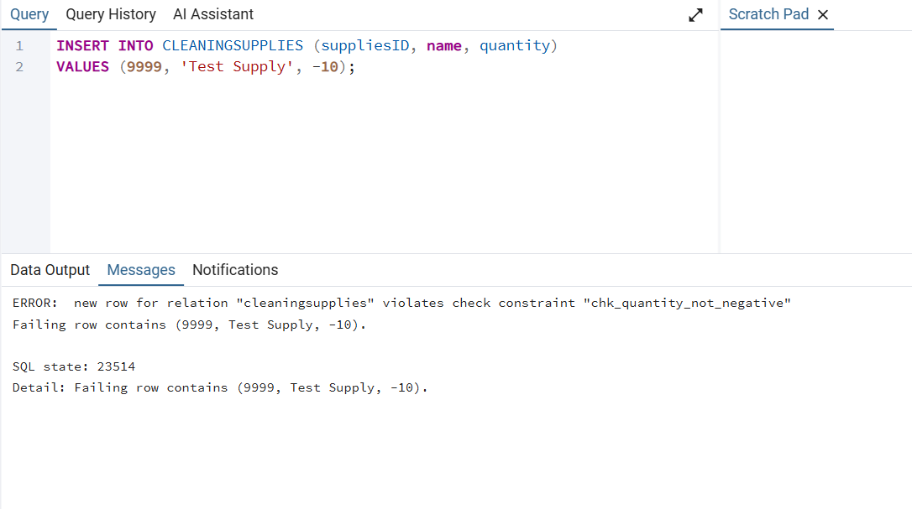

---

### 2. Score Range Validation (ROOMCHECK Table)
**Description:** A `CHECK` constraint that limits the score column to values between 0 and 100 only. This enforces the business logic regarding scoring standards and ensures data accuracy.

**SQL Code:**
```sql
-- Constraint 2: Check that the score is between 0 and 100
ALTER TABLE ROOMCHECK 
ADD CONSTRAINT chk_score_range CHECK (score >= 0 AND score <= 100);
```
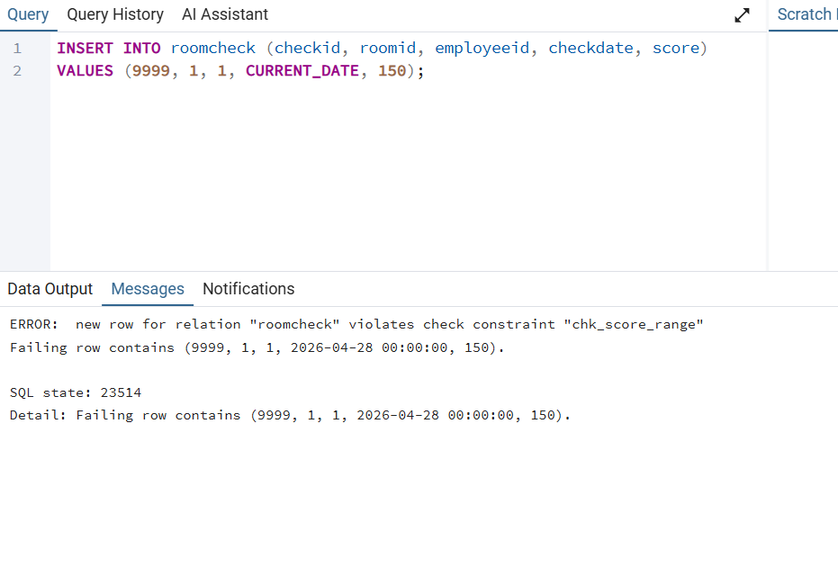
---

### 3. Task Uniqueness Prevention (HOUSEKEEPINGTASK Table)
**Description:** A `UNIQUE` constraint applied to a combination of three fields: Room ID (`roomid`), Task Type (`tasktypeid`), and Due Date (`duedate`). This ensures that the same task cannot be assigned to the same room more than once on a specific date.

**SQL Code:**
```sql
-- Constraint 3: Ensure a unique task per room, type, and date
ALTER TABLE housekeepingtask
ADD CONSTRAINT unique_task_room_date UNIQUE (roomid, tasktypeid, duedate);
```
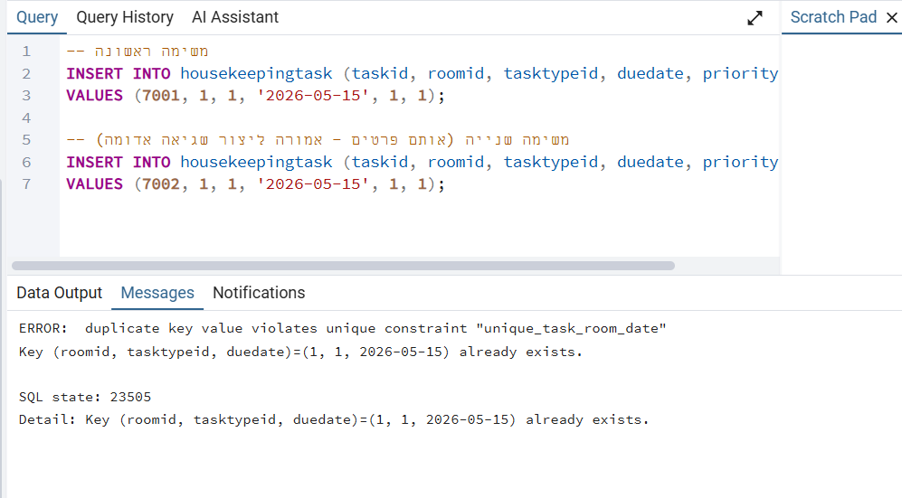


### Stage C: Integration and Views

1. Reverse Engineering of the New Department
In this stage, we received the database backup for the "Human Resources and Employees" department. To integrate it with our system, we performed a reverse engineering process to reconstruct its logical structure (ERD).

Reverse Engineering Algorithm:
The process we followed to extract the Entity Relationship Diagram (ERD) from the existing database tables included the following steps:

Mapping Tables to Entities: Every table in the database that was not a dedicated link table (Join table) was defined as an independent Entity in the ERD.

Extracting Primary Keys (PK): Columns defined as Primary Keys in PostgreSQL were mapped as the identifying attributes (Key Attributes) in the diagram.

Identifying Relationships via Foreign Keys (FK): Columns defined as Foreign Keys served as the indicators for relationships between entities.

Determining Cardinality:

If a Foreign Key was found within a table, it indicated a 1:N relationship (the table containing the FK is the "Many" side).

If a table consisted primarily of two Foreign Keys pointing to two different tables, it was defined as an M:N relationship.

Translating Columns to Attributes: Remaining fields in the tables (such as names, dates, and strings) were converted into Attributes for their respective entities.


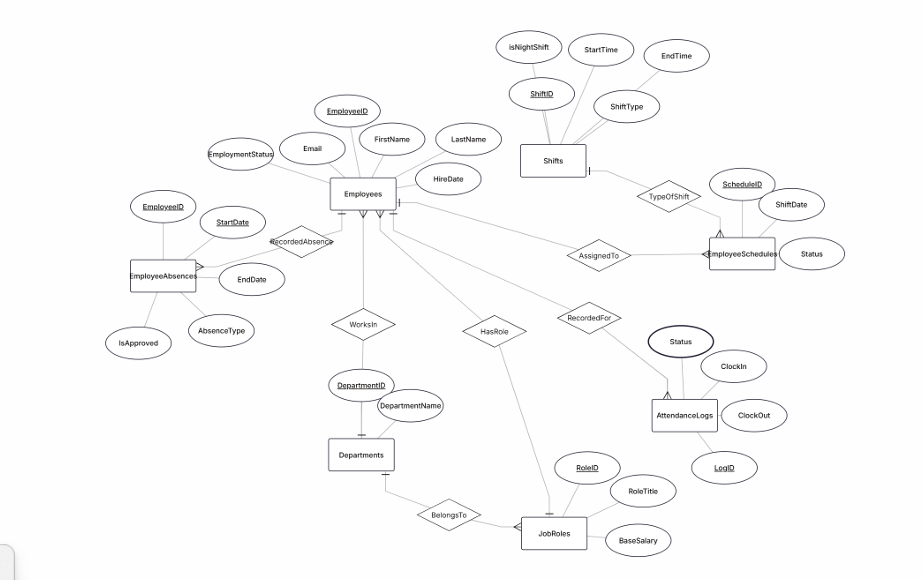

2. Integration Stage (Design Level)
After obtaining both ERD diagrams, we designed a unified ERD that merges our Housekeeping Management system with the provided Employee Management system.

Integration Decisions:
Removal of Link Tables: In our original design, the connection between an employee and a task was handled through a separate relationship table. We decided to eliminate this table and add an employeeid column directly into our core tables: housekeepingtask, cleaninglog, and roomcheck. This decision simplifies data retrieval and reduces unnecessary joins.

Referential Integrity: We established that every cleaning record or inspection must be linked to an existing employee from the unified Employees table to ensure that we can always identify the staff member responsible for any action in the hotel.

Post-Integration Diagrams:
Unified ERD:


Post-Integration DSD: 


3. Technical Implementation (Integrate.sql)
We implemented the changes in the existing database without deleting existing data. We utilized ALTER TABLE commands to add the new link columns (ADD COLUMN) and then defined the foreign key constraints (ADD CONSTRAINT). To ensure the views displayed relevant data for the report, we executed UPDATE commands to link our existing records to employees found in the provided backup.

📜 [Link to Integrate.sql](./stage3/Integrate.sql)

4. Views and Queries
Below are the three Views created to combine data from both departments.

📜 [Link to Views.sql](./stage3/Views.sql)

View 1: Cleaning Assignments (cleaning_assignments_view)
Description: This view joins the cleaning logs with the names of the employees responsible for them.

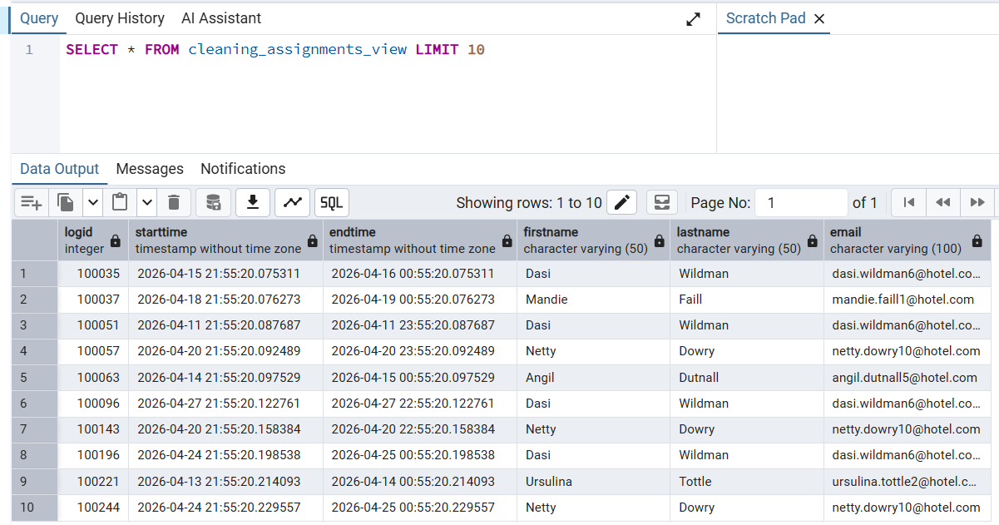

Queries on the View:

Count the number of cleanings performed by each employee by name.

Code: SELECT firstname, lastname, COUNT(*) FROM cleaning_assignments_view GROUP BY firstname, lastname;
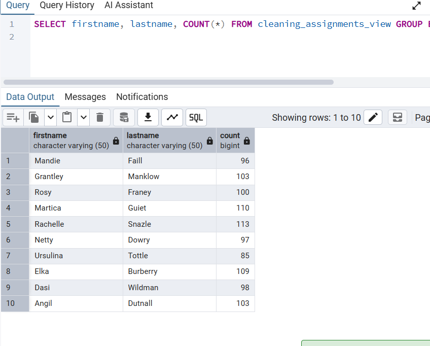

Retrieve all cleanings performed by a specific employee (e.g., 'Dasi').

Code: SELECT * FROM cleaning_assignments_view WHERE firstname = 'Dasi';

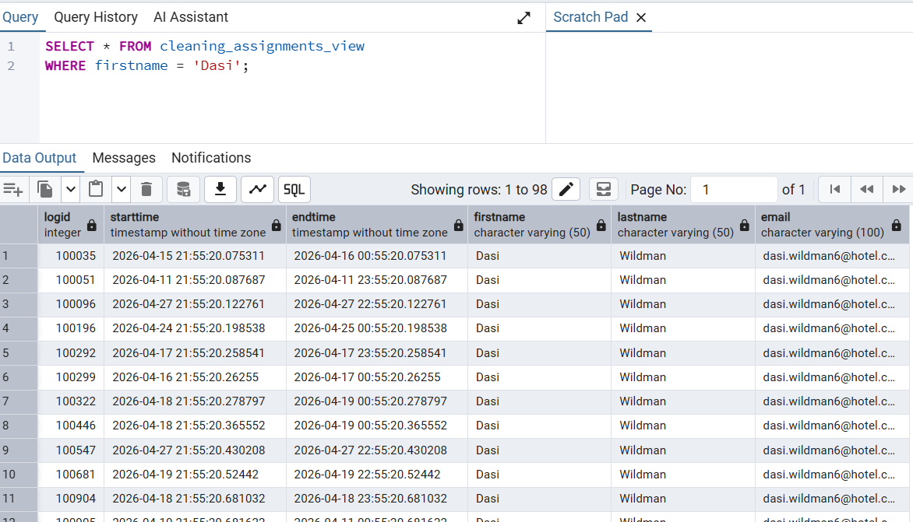

View 2: Room Inspection Report (room_inspection_report)
Description: This view displays quality inspection results along with the details of the inspector who performed the check.

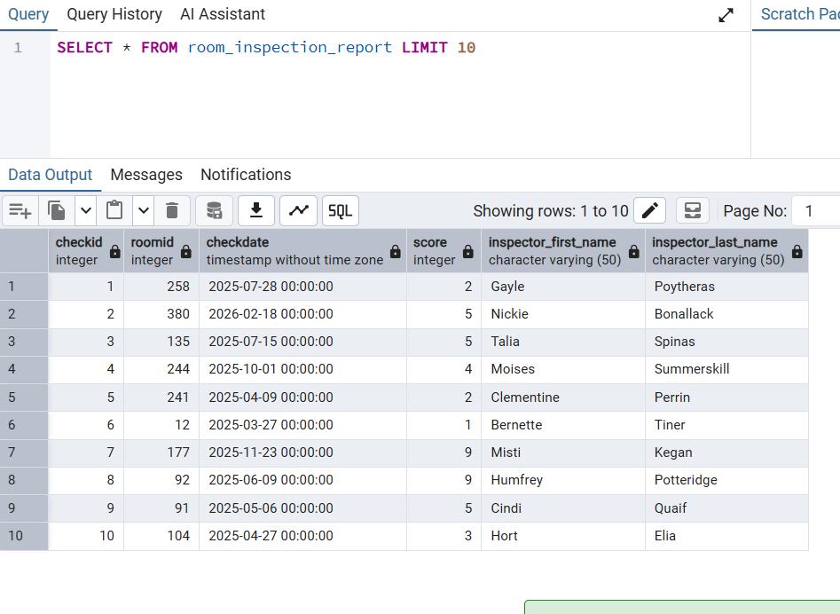

Queries on the View:

Display the average score given by each inspector.

Code: SELECT inspector_first_name, AVG(score) FROM room_inspection_report GROUP BY inspector_first_name;
 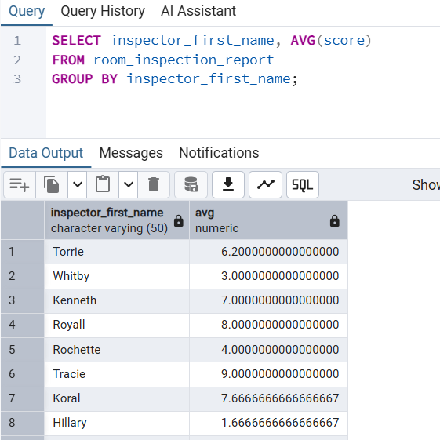

Retrieve inspections that received a score lower than 3.

Code: SELECT * FROM room_inspection_report WHERE score < 3;

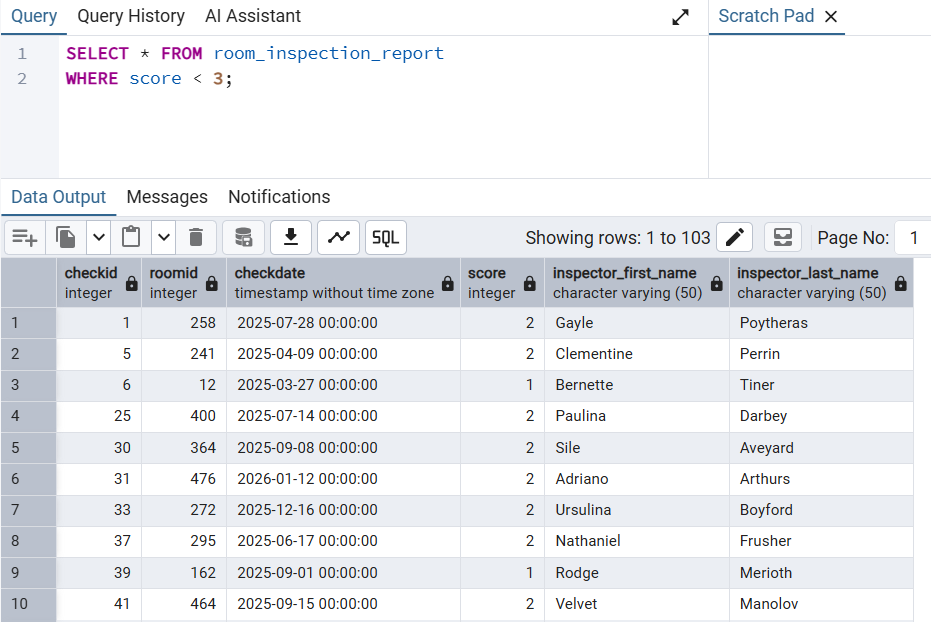

View 3: Task Management Overview (task_employee_overview)
Description: An integrated view centralizing open tasks, their priority levels, and the assigned employee.

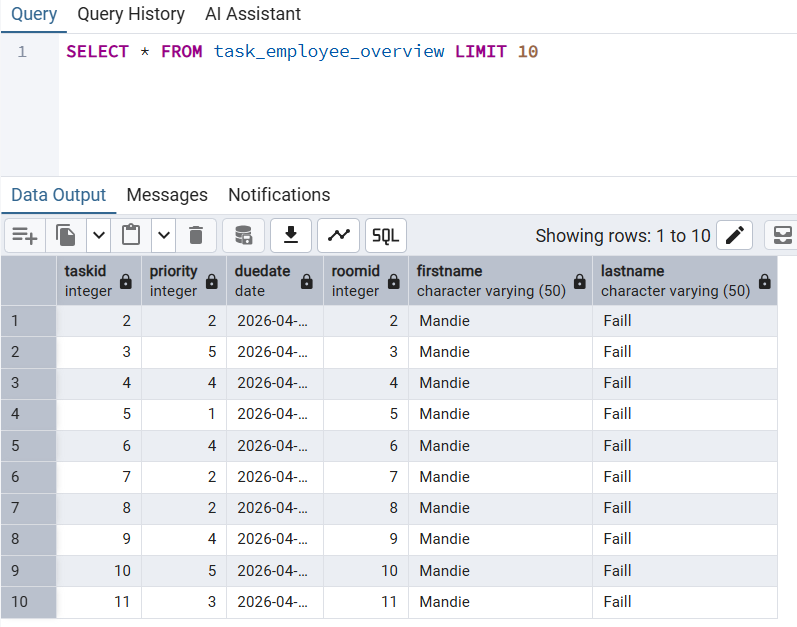

Queries on the View:

Display only urgent tasks (Priority 1).

Code: SELECT * FROM task_employee_overview WHERE priority = 1;

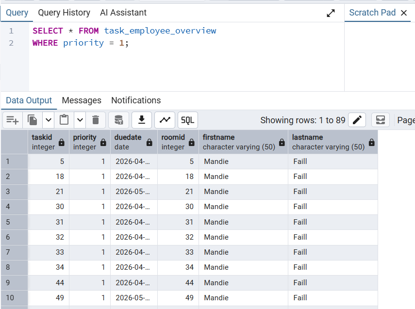

Display tasks associated with a specific room (e.g., Room 104).

Code: SELECT * FROM task_employee_overview WHERE roomid = 104;

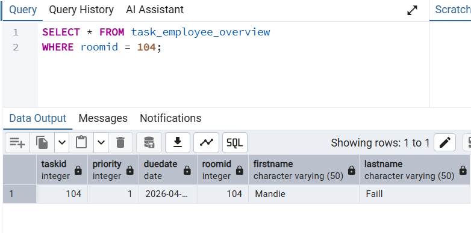


##  Phase 4
 
## 1. Database Schema Changes (Alter Tables)

**Description:** In preparation for writing the PL/pgSQL programs (functions, procedures, and triggers), several changes and extensions were made to the existing database tables to enable more complex, non-trivial logic. 
* Added a `room_status` column (to track whether the room is clean or dirty) and an `urgency_level` column (to indicate cleaning priority) to the `room` table.
* Added a `task_status` column to the `cleaninglog` table to represent the current state of a cleaning task (e.g., Open, Completed).

📜 [AlterTable.sql](https://github.com/yaelcohen2/DBProject_5688_5970/blob/main/stage4/AlterTable.sql)

**Proof of Execution:** Below are screenshots confirming that the `ALTER TABLE` commands ran successfully, along with the results of the test queries showing the newly added columns in the `room` and `cleaninglog` tables:

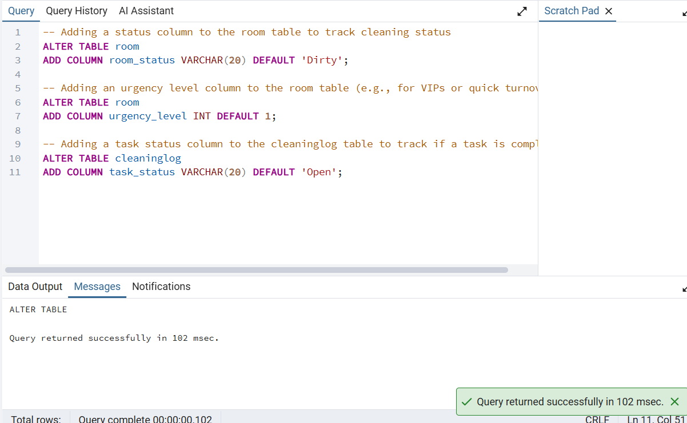

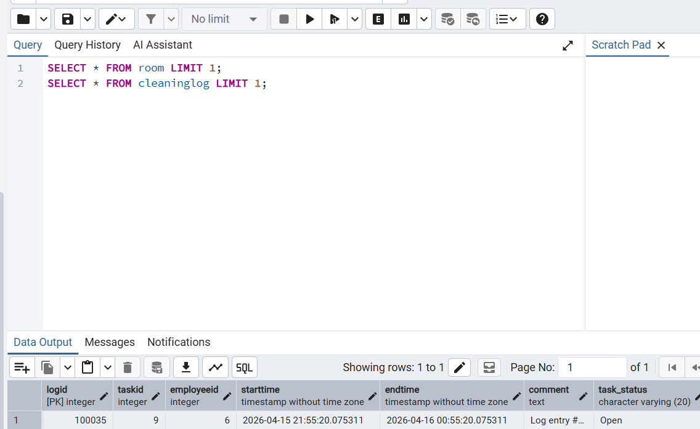


## 2. Functions

### Function 1: Get Dirty Rooms (Ref Cursor)

**Description:** This function receives a minimum urgency level as a parameter and returns a `Ref Cursor`. The cursor contains all rooms that are currently marked as 'Dirty' and have an urgency level equal to or greater than the provided threshold. The results are ordered by urgency level in descending order.


📜[Function_GetDirtyRooms.sql](https://github.com/yaelcohen2/DBProject_5688_5970/blob/main/stage4/Function_GetDirtyRooms.sql)

**Proof of Execution:** Below is the screenshot showing the successful creation of the function, followed by a screenshot of an anonymous transaction block executing the function and fetching the records from the returned cursor:

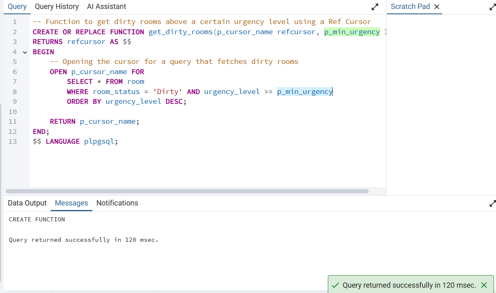

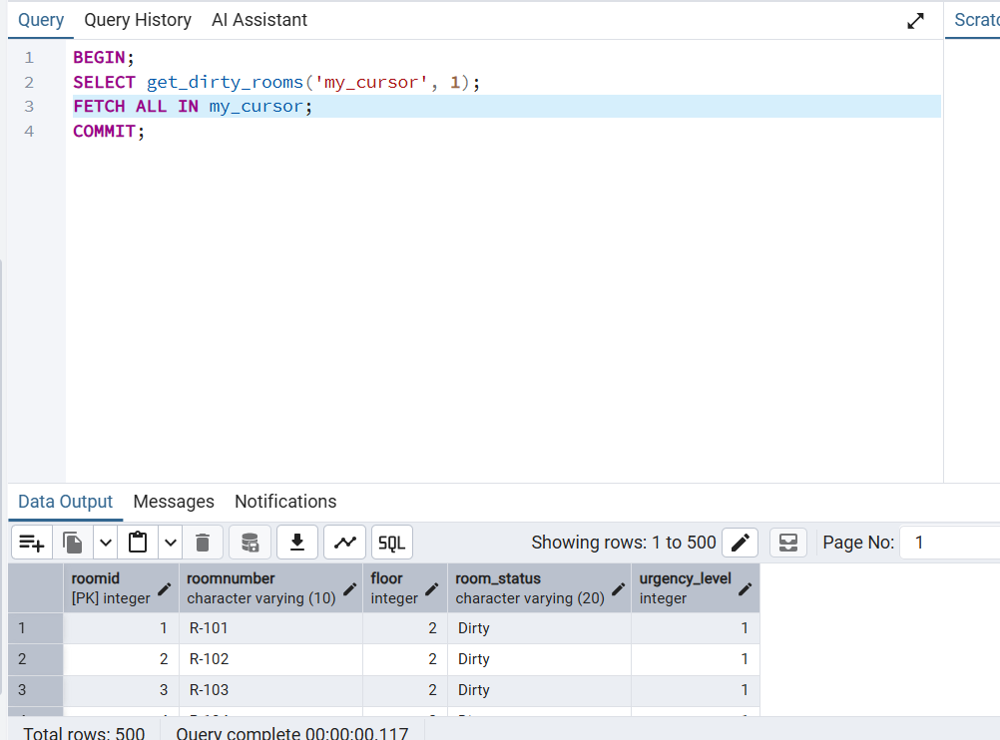

---

### Function 2: Get Busy Cleaners Count (Explicit Cursor & Records)

**Description:** This function counts and returns the total number of housekeeping employees who currently have at least one 'Open' task. It utilizes an **Explicit Cursor** to iterate through all employees in the `housekeepingemployee` table, fetching each row into a **Record** variable. Inside the loop, it checks the `cleaninglog` table for open tasks associated with that specific employee.

📜[Function_GetBusyCleaners.sql](https://github.com/yaelcohen2/DBProject_5688_5970/blob/main/stage4/Function_GetBusyCleaners.sql)

**Proof of Execution:** Below are the screenshots showing the successful creation of the function and the execution result showing the count of currently busy cleaners:

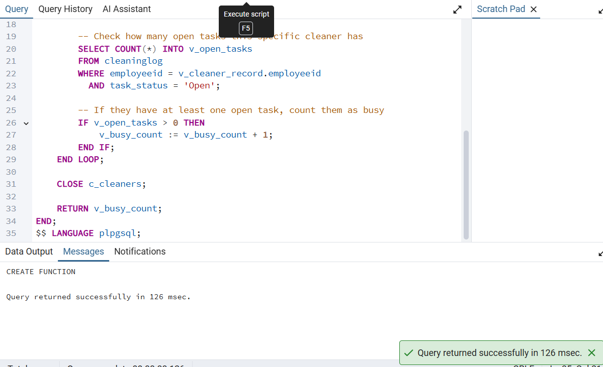

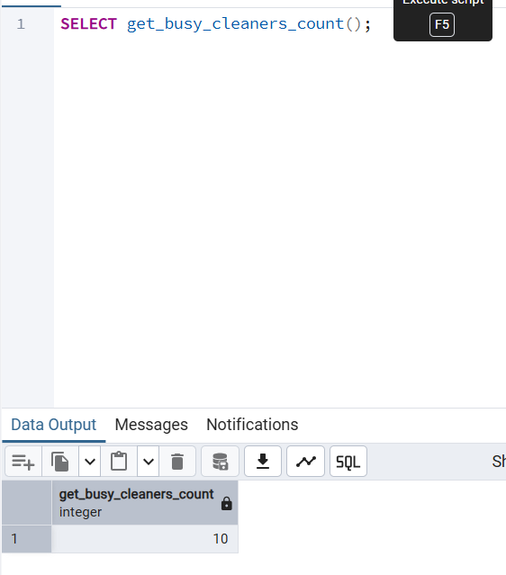


## 3. Procedures

### Procedure 1: Assign Cleaning Task (DML, IF, Exceptions)

**Description:** This procedure dynamically assigns a cleaning task to a specific housekeeping employee. It accepts a room ID, a task ID, and an employee ID as parameters. First, it checks if the room is already 'Clean'—if it is, it throws a custom **Exception**. If the room is not clean, it uses an **IF** statement to execute **DML** commands: it inserts a new row into the `cleaninglog` table with an 'Open' status and updates the `room` table to change the status to 'In Progress'.

📜[Procedure_AssignTask.sql](https://github.com/yaelcohen2/DBProject_5688_5970/blob/main/stage4/Procedure_AssignTask.sql)

**Proof of Execution:** Below are screenshots showing the successful creation of the procedure, a successful assignment of a task (verifying the DML insert and update), and a test demonstrating the custom exception being thrown when trying to clean an already clean room:

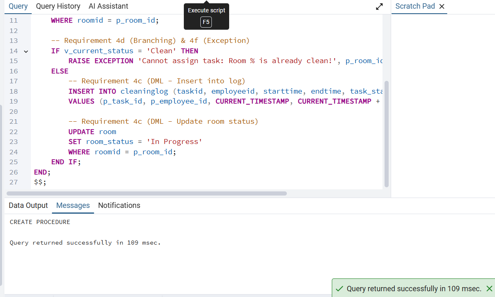

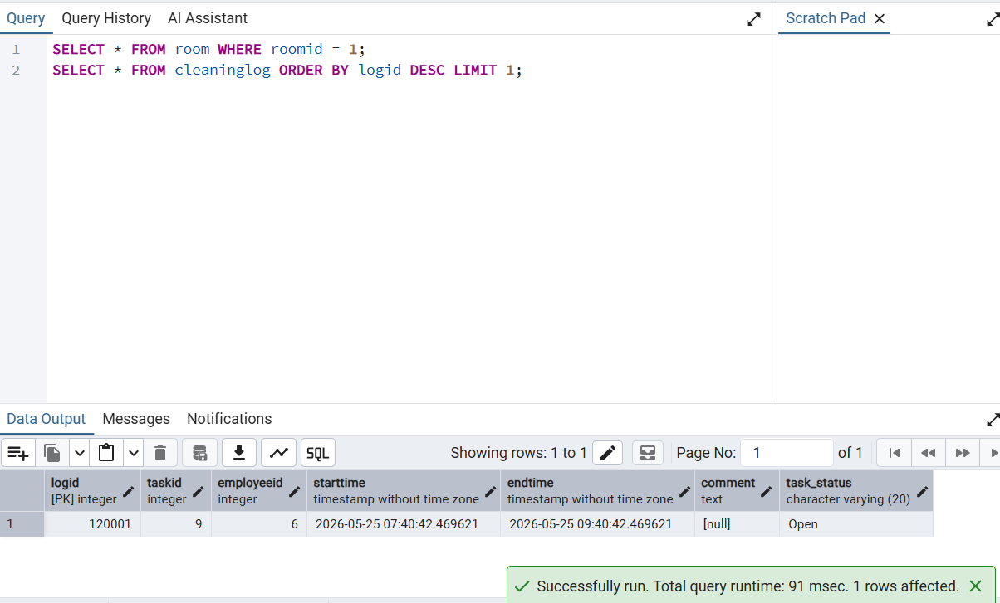

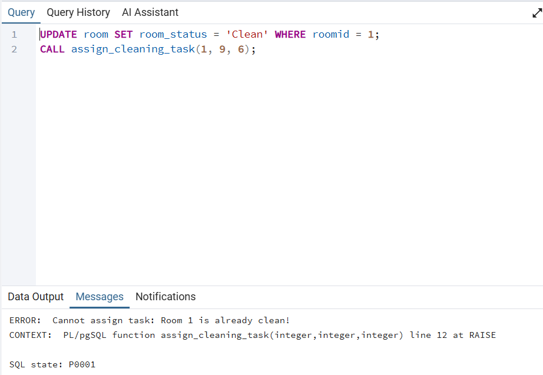


---

### Procedure 2: Auto-Suspend Overdue Tasks (Loops, DML)

**Description:** This procedure performs a bulk update at the end of a shift or schedule check. It uses a **Loop** to iterate through all tasks in the `cleaninglog` table. If it finds a task that is still marked as 'Open' but its scheduled `endtime` has already passed, it automatically executes a **DML UPDATE** command to change the `task_status` to 'Suspended'.

📜[Procedure_SuspendOverdueTasks.sql](https://github.com/yaelcohen2/DBProject_5688_5970/blob/main/stage4/Procedure_SuspendOverdueTasks.sql)

**Proof of Execution:** Below are screenshots showing the successful creation of the procedure, and a test demonstrating the results in the `cleaninglog` table after calling the procedure, proving that the overdue task was successfully updated to 'Suspended':

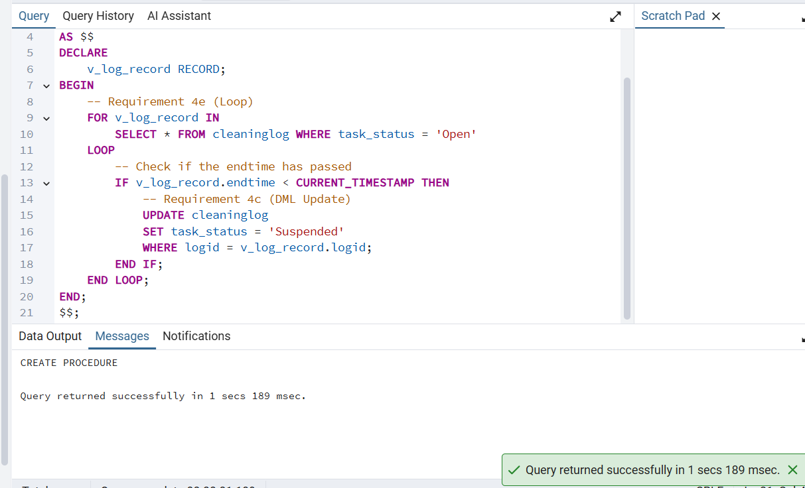

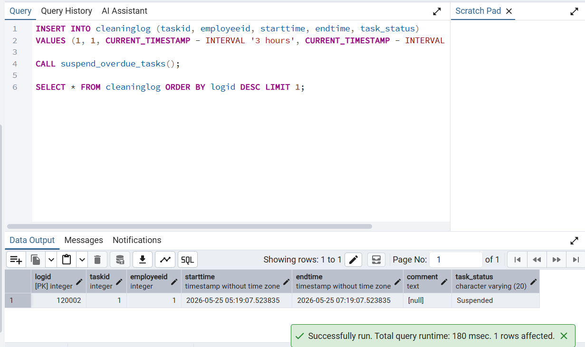


## 4. Triggers

### Trigger 1: Enforce Employee Workload Limit

**Description:** This trigger ensures that a single housekeeping employee is not overwhelmed with too many tasks at once. It fires `BEFORE INSERT OR UPDATE` on the `cleaninglog` table. The trigger function checks how many 'Open' tasks the assigned employee currently has. If the employee already has 3 or more open tasks, the trigger aborts the operation and raises a custom exception to prevent assigning a new task.

📜[Trigger_CheckWorkload.sql](https://github.com/yaelcohen2/DBProject_5688_5970/blob/main/stage4/Trigger_CheckWorkload.sql)

**Proof of Execution:** Below is the screenshot showing the successful creation of the trigger function and the trigger itself. The second screenshot demonstrates the trigger in action: attempting to insert an excessive 'Open' task for an employee results in the custom exception being raised, successfully preventing the database insertion.

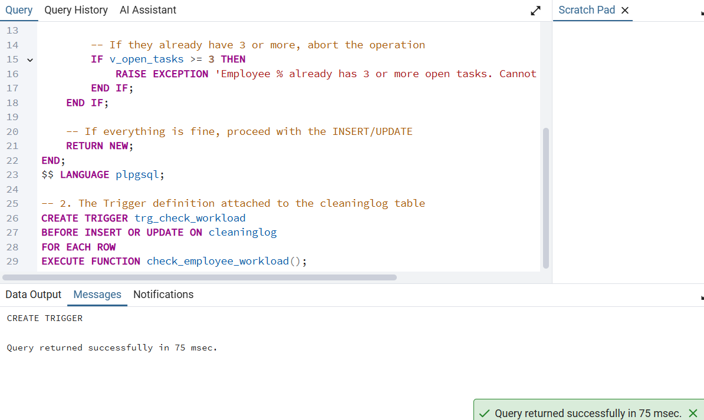

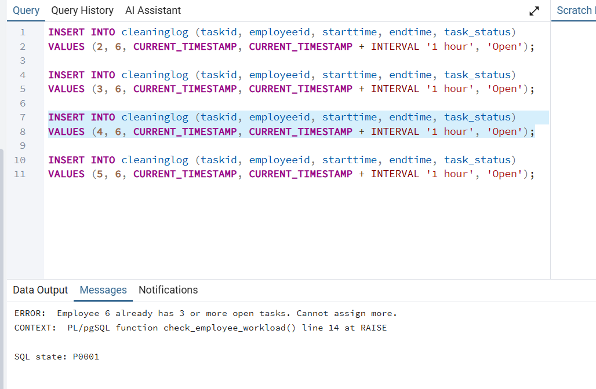


### Trigger 2: Prevent Deletion of Active Rooms (UPDATE/DELETE)

**Description:** This trigger prevents the accidental deletion of a room if it is currently being cleaned. It fires `BEFORE DELETE` on the `room` table. The trigger function checks the `OLD.room_status`. If the status is 'In Progress', it blocks the deletion process and raises a custom exception. 

📜[Trigger_PreventRoomDelete.sql](https://github.com/yaelcohen2/DBProject_5688_5970/blob/main/stage4/Trigger_PreventRoomDelete.sql)

**Proof of Execution:** Below is the screenshot showing the successful creation of the trigger, followed by a screenshot demonstrating an attempt to delete a room that is 'In Progress', which successfully triggers the custom exception and prevents the deletion.

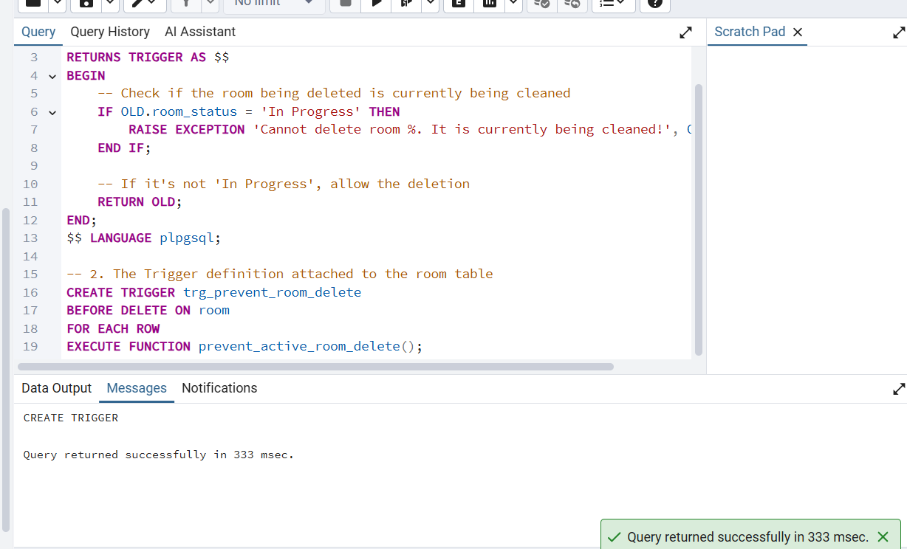

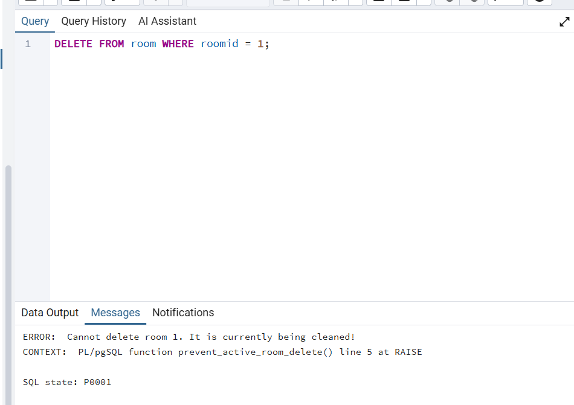

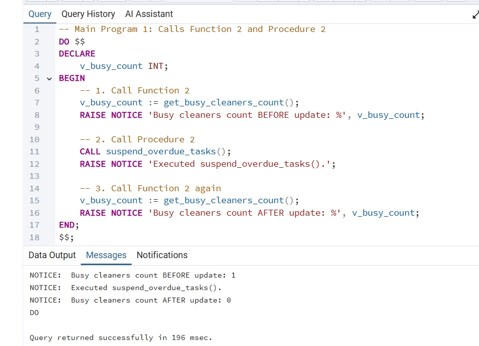
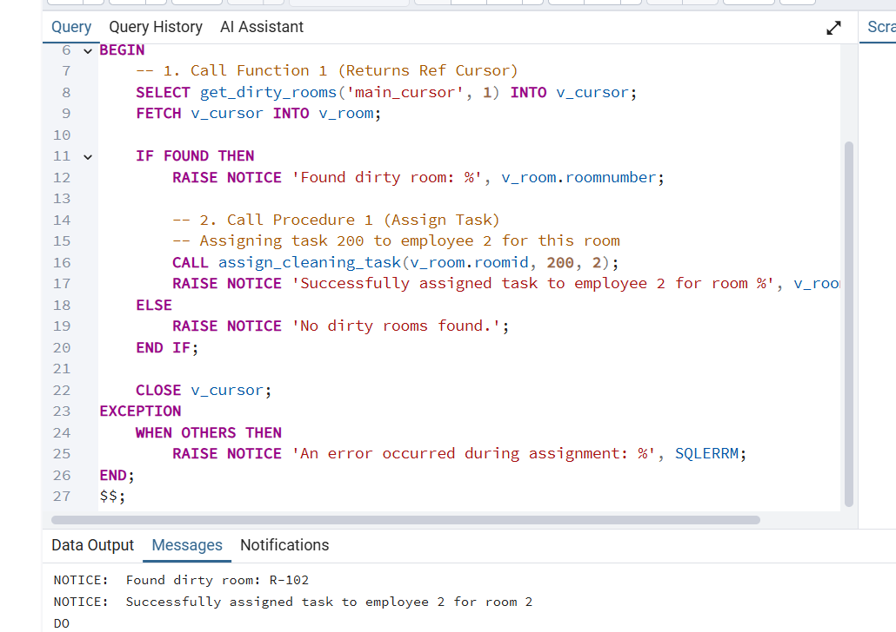

## 5. Main Program

### Main Program 1: Automated Task Management

This program demonstrates a complete, automated workflow for managing housekeeping tasks. It calls a function to identify work that needs to be done and then calls a procedure to act on that information.

**Workflow:**
1.  **Call Function `GetDirtyRooms()`**: The program first calls a function to query the database and find a room that is currently marked with a 'Dirty' status.
2.  **Call Procedure `SuspendOverdueTasks()`**: After identifying a room, the program then calls a procedure that automatically reviews all tasks and updates the status of any that are past their due date to 'Maintenance Required'.

This showcases how functions and procedures can be combined to create complex, automated business logic directly within the database.

**Proof of Execution:**
The following image shows the successful execution of the main program. The "Messages" tab displays the `RAISE NOTICE` output, confirming that the function found a dirty room and the procedure was called to handle overdue tasks.


### Main Program 2: Dynamic Task Assignment

This program demonstrates a more complex workflow that involves finding a dirty room, finding an available employee, and then dynamically assigning the cleaning task.

**Workflow:**
1.  **Call Function `GetDirtyRooms()`**: The program calls a function to find a room that needs cleaning.
2.  **Call Function `GetBusyCleaners()`**: It then calls another function to get a list of employees who are currently busy.
3.  **Find Available Employee**: The program queries the employee table to find an employee who is *not* in the busy list.
4.  **Call Procedure `AssignTask()`**: Finally, it calls the `AssignTask` procedure, passing the IDs of the dirty room and the available employee to create a new cleaning assignment in the system.

**Proof of Execution:**
The image below shows the program running. The `RAISE NOTICE` messages confirm that a dirty room and an available employee were found, and that the `AssignTask` procedure was called to create the new task.


