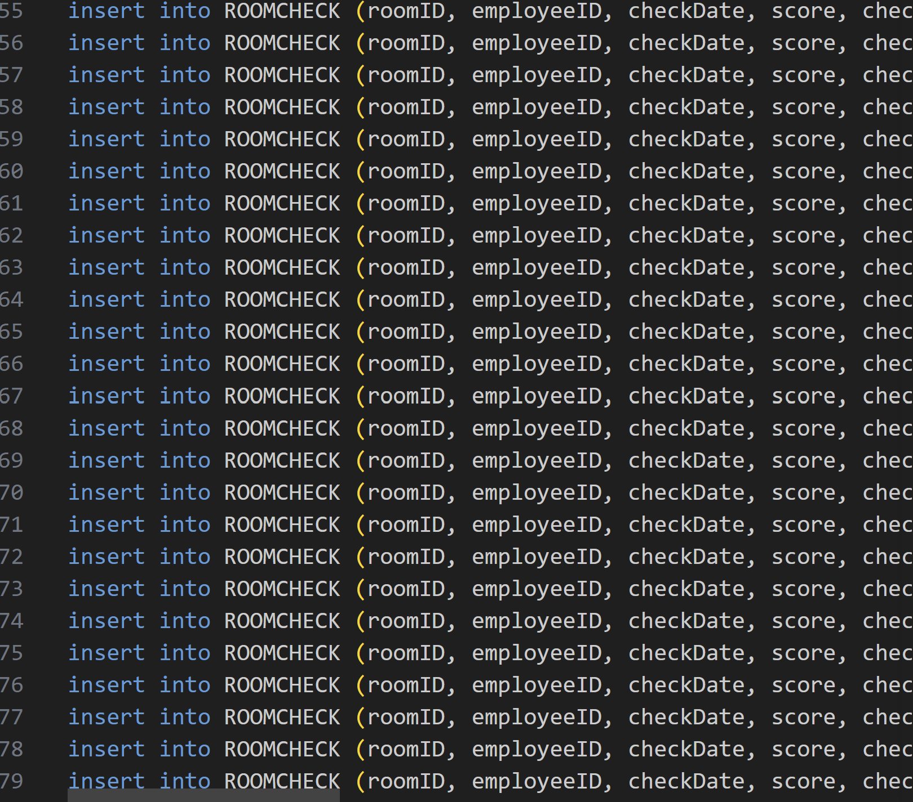

# 🏨 Hotel Management System - Housekeeping Unit

**Project Report**

**Authors:** Shani Levy and Yael Cohen

---

## 📑 Table of Contents
- [Introduction](#-introduction)
- [ERD & DSD](#-erd--dsd)
- [Insertion Methods](#-insertion-methods)
- [Backup & Restore Strategy](#-backup--restore-strategy)

---

איפיון המערכת - שנוצר על ידי Google AI Studio
https://aistudio.google.com/apps/45d4298d-a5b6-4634-97e4-b68336430388?showPreview=true&showAssistant=true

## 📋 Introduction
The system is a platform for managing the Housekeeping department in a hotel, designed to streamline cleaning, maintenance, and supervision processes in a smart and organized manner.
The system allows tracking and management of the following entities:

  **Rooms (`ROOM`)**:
    Managing the list of physical rooms in the hotel and ongoing monitoring.

  **Tasks and Cleaning Types (`TASKTYPE`, `HOUSEKEPINGTASK`)**:
    Defining task types (such as deep cleaning, evening turndown) and scheduling specific tasks for rooms, including priority and deadlines.

  **Statuses (`HOUSEKEEPINGSTATUS`)**:
    Real-time tracking of room/task status (e.g., dirty, in progress, clean, inspected).

  **Employees (`HOUSEKEEPINGEMPLOYEE`)**:
    Managing housekeeping employee details and shift schedules.

  **Execution Log (`CLEANNINGLOG`)**:
    Real-time digital documentation of task execution, including start/end times and employee notes.

  **Quality Control (`ROOMCHECK`)**:
    Inspections performed by supervisors, assigning quality scores for cleaning, and maintaining inspection history for continuous improvement.

  **Inventory and Supplies (`CLEANNINGSUPPLIES`, `USES`)**:
    Managing inventory of cleaning supplies and tools, and precise tracking of quantities consumed per task.

  **Employee-Task Relations (`BELONGSTO`)**:
    Smart assignment of employees to specific tasks for efficient execution.

---

## 📊 ERD & DSD

### 🔗 Entity Relationship Diagram (ERD)

### 📉 Data Structure Diagram (DSD)

## 🔄 Insertion Methods

### Method 1: Data Generation
We utilized **Mockaroo** to generate realistic and structured dummy data for our database tables. This tool allowed us to define specific data types (e.g., names, dates, custom lists) and ensure referential integrity between tables (Foreign Keys). The configuration involved setting up fields exactly matching our ERD, generating thousands of records to simulate a busy hotel environment.

### Method 2: Insert
To populate the database, we use standard SQL `INSERT` statements generated from our data source.
- **SQL Execution**: The `.sql` files containing the data are executed against the database tables.
- **Data Integrity**: This direct method ensures that data is added in the correct sequence, respecting all foreign key constraints.

### Method 3: Scripted Insertion
A dedicated Python script (`insert_data.py`) was developed to automate the data insertion process. The script handles:
- Establishing a connection to the database.
- Reading and parsing the generated data files.
- Executing `INSERT` statements in batches for efficiency.
- Handling data type conversions (e.g., date formats) and error checking during insertion.

### Method 4: Backup & Restore Strategy
To ensure data safety and continuity, we implemented a robust backup and restore strategy. Regular SQL dumps of the entire database schema and data are generated.
- **Backup**: Creating `.sql` snapshot files (e.g., `backup_19_03_2026.sql`) containing all logical data.
- **Restore**: The ability to reconstruct the database state from these files in case of failure or data corruption.

